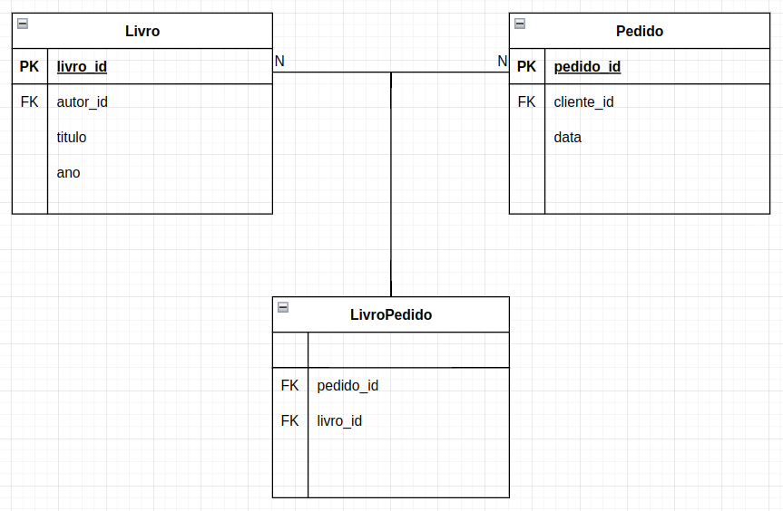
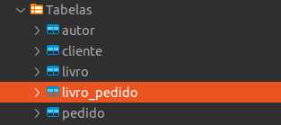
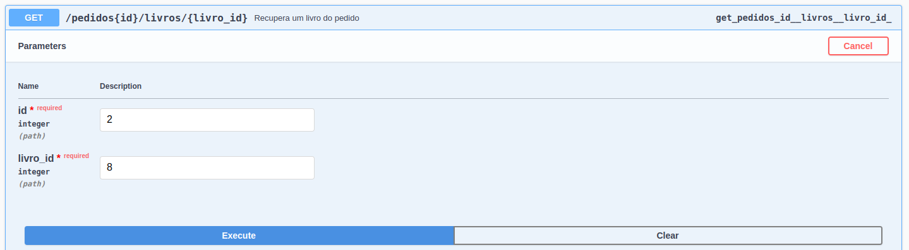

# Aula 12

## Criando os endpoints de clientes

Pasta cliente:
- clientes.py:

```python
from db import db


class Cliente(db.Model):
    __tablename__ = 'cliente'

    cliente_id = db.Column(db.Integer, primary_key=True)
    nome = db.Column(db.String(255))
    cpf = db.Column(db.String(14))  # com a máscara
    data_nascimento = db.Column(db.DateTime)

    def __init__(self, nome, cpf, data_nascimento):
        self.nome = nome
        self.cpf = cpf
        self.data_nascimento = data_nascimento

    def serialize(self):
        return {
            'cliente_id': self.cliente_id,
            'nome': self.nome,
            'cpf': self.cpf,
            'data_nascimento': self.data_nascimento.isoformat()
        }
    
    # Método para o GET (todos)
    @classmethod
    def list(cls):
        return cls.query.all()

    # Método para o GET
    @classmethod
    def retrieve(cls, id):
        return cls.query.filter_by(cliente_id=id).first()

    # Método para o POST / UPDATE
    def save(self):
        db.session.add(self)
        db.session.commit()

    # Método para o DELETE
    def delete(self):
        db.session.delete(self)
        db.session.commit()
```

- resources.py:

```python
from flask_restful import Resource, reqparse

from cliente.clientes import Cliente
from cliente.validators import cpf_valido


parser = reqparse.RequestParser()
parser.add_argument(
    'cliente_id',
    type=int,
    required=False
)
parser.add_argument(
    'nome',
    type=str,
    required=True,
    help='Nome inválido.'
)
parser.add_argument(
    'cpf',
    type=cpf_valido,
    required=True,
    help='CPF inválido.'
)
parser.add_argument(
    'data_nascimento',
    type=str,
    required=True,
    help='Data de nascimento inválido.'
)


class ClienteListResource(Resource):
    def get(self):
        """
        Recupera todos os clientes
        ---
        tags:
          - clientes
        responses:
          200:
            description: lista de clientes
        """
        clientes = Cliente.list()
        resposta = {
            'dados': [cliente.serialize() for cliente in clientes]
        }
        return resposta, 200
    
    def post(self):
        """
        Adicionar cliente
        ---
        tags:
          - clientes
        parameters:
          - name: body
            in: body
            required: true
            schema:
              type: object
              properties:
                nome:
                  type: string
                cpf:
                  type: string
                data_nascimento:
                  type: string
        responses:
          201:
            description: cliente criado
          400:
            description: dados inválidos
        """
        request_data = parser.parse_args()
        nome = request_data.get('nome')
        cpf = request_data.get('cpf')
        data_nascimento = request_data.get('data_nascimento')
        cliente = Cliente(nome, cpf, data_nascimento)
        cliente.save()
        resposta = {
            'dados': [cliente.serialize()]
        }
        return resposta, 201
    

class ClienteResource(Resource):
    def get(self, id):
        """
        Recuperar cliente
        ---
        tags:
          - clientes
        parameters:
          - name: id
            in: path
            type: integer
            required: true
        responses:
          200:
            description: cliente
          404:
            description: cliente não encontrado
        """
        cliente = Cliente.retrieve(int(id))
        if not cliente:
            resposta = {
                'dados': []
            }
            return resposta,  404
        
        resposta = {
            'dados': [cliente.serialize()]
        }
        return resposta, 200
    
    def put(self, id):
        """
        Atualizar cliente
        ---
        tags:
          - clientes
        parameters:
          - name: id
            in: path
            type: integer
            required: true
          - name: body
            in: body
            required: true
            schema:
              type: object
              properties:
                nome:
                  type: string
                cpf:
                  type: string
                data_nascimento:
                  type: string
        responses:
          200:
            description: cliente atualizado
          400:
            description: dados inválidos
          404: 
            description: cliente não encontrado
        """
        cliente = Cliente.retrieve(int(id))
        if not cliente:
            resposta = {
                'dados': []
            }
            return resposta,  404

        request_data = parser.parse_args()
        nome = request_data.get('nome')
        cpf = request_data.get('cpf')
        data_nascimento = request_data.get('data_nascimento')
        cliente.nome = nome
        cliente.data_nascimento = data_nascimento
        cliente.save()
        resposta = {
            'dados': [cliente.serialize()]
        }
        return resposta, 200

    def delete(self, id):
        """
        Deletar cliente
        ---
        tags:
          - clientes
        parameters:
          - name: id
            in: path
            type: integer
            required: true
        responses:
          204:
            description: cliente deletado
          404:
            description: cliente não encontrado
        """
        cliente = Cliente.retrieve(int(id))
        if not cliente:
            resposta = {
                'dados': []
            }
            return resposta,  404
        
        cliente.delete()
        resposta = {
            'dados': []
        }
        return resposta, 204
```

- main.py:

```python
api.add_resource(ClienteResource, '/clientes/<id>')
api.add_resource(ClienteListResource, '/clientes/')
```

## Adicionando validações

Pasta útils:
- utils.py (validação de cpf e máscara de cpf)

```python
def _retorna_digitos(texto):
    if not texto or not isinstance(texto, str):
        return None
    return ''.join([c for c in texto if c.isdigit()])

def valida_cpf(cpf):
    cpf = _retorna_digitos(cpf)
    if not cpf or len(cpf) != 11:
        return False

    # Primeiro dígito
    relacao_digito_peso = zip(
        [int(digito) for digito in cpf[0:-2]], [peso for peso in range(10, 1, -1)])
    resto_soma = sum(
        [digito * peso for digito, peso in relacao_digito_peso]) % 11
    digito_esperado = 11 - resto_soma if resto_soma >= 2 else 0
    if cpf[-2] != str(digito_esperado):
        return False

    # Segundo dígito
    relacao_digito_peso = zip(
        [int(digito) for digito in cpf[0:-1]], [peso for peso in range(11, 1, -1)])
    resto_soma = sum(
        [digito * peso for digito, peso in relacao_digito_peso]) % 11
    digito_esperado = 11 - resto_soma if resto_soma >= 2 else 0
    if cpf[-1] != str(digito_esperado):
        return False

    return True


def mascara_cpf(cpf):
    if valida_cpf(cpf):
        cpf = _retorna_digitos(cpf)
        return f'{cpf[:3]}.{cpf[3:6]}.{cpf[6:9]}-{cpf[9:11]}'
    return None
```

Dentro da pasta cliente, criar um arquivo chamado validators.py, com uma função que retorna uma excption se o cpf for inválido, ou então o cpf mascarado se for válido:

```python
from utils.utils import valida_cpf, mascara_cpf


def cpf_valido(value, name):
    if not valida_cpf(value):
        raise ValueError('CPF inválido.')
    return mascara_cpf(value)
```

Esta função deve ser passado no lugar do "type" do argumento "cpf" no parser do cliente:

```python
parser.add_argument(
    'cpf',
    type=cpf_valido,  # chamada da função de validação
    required=True,
    help='CPF inválido.'
)
```

Desta forma ao tentar cadastrar um cliente com um cpf inválido, por exemplo:

```json
{
  "cpf": "12345",
  "data_nascimento": "1992-03-11",
  "nome": "Emanoeli"
}
```

Teremos o erro:

```json
{
  "message": {
    "cpf": "CPF inválido."
  }
}
```

Caso o cpf seja válido e seja enviado sem a máscara, ao fazer o get você poderá verificar que ele ficou salvo com máscara.

## Criando endpoints de pedidos

Pasta pedido:
- pedidos.py:

```python
from db import db
from cliente.clientes import Cliente


class Pedido(db.Model):
    __tablename__ = 'pedido'

    pedido_id = db.Column(db.Integer, primary_key=True)
    cliente_id = db.Column(db.Integer, db.ForeignKey('cliente.cliente_id'))
    data = db.Column(db.DateTime)

    def __init__(self, cliente_id, data):
        self.cliente_id = cliente_id
        self.data = data

    def serialize(self):
        cliente = Cliente.retrieve(self.cliente_id)
        dados_cliente = cliente.serialize() if cliente else None
        return {
            'pedido_id': self.pedido_id,
            'cliente': dados_cliente,
            'data': self.data.isoformat()
        }
    
    # Método para o GET (todos)
    @classmethod
    def list(cls):
        return cls.query.all()

    # Método para o GET
    @classmethod
    def retrieve(cls, id):
        return cls.query.filter_by(pedido_id=id).first()

    # Método para o POST / UPDATE
    def save(self):
        db.session.add(self)
        db.session.commit()

    # Método para o DELETE
    def delete(self):
        db.session.delete(self)
        db.session.commit()
```

- resources.py:

```python
from flask_restful import Resource, reqparse

from pedido.pedidos import Pedido


parser = reqparse.RequestParser()
parser.add_argument(
    'pedido_id',
    type=int,
    required=False
)
parser.add_argument(
    'cliente_id',
    type=int,
    required=True,
    help='Cliente id inválido.'
)
parser.add_argument(
    'data',
    type=str,
    required=True,
    help='Data inválido.'
)


class PedidoListResource(Resource):
    def get(self):
        """
        Recupera todos os pedidos
        ---
        tags:
          - pedidos
        responses:
          200:
            description: lista de pedidos
        """
        pedidos = Pedido.list()
        resposta = {
            'dados': [pedido.serialize() for pedido in pedidos]
        }
        return resposta, 200
    
    def post(self):
        """
        Adicionar pedido
        ---
        tags:
          - pedidos
        parameters:
          - name: body
            in: body
            required: true
            schema:
              type: object
              properties:
                cliente_id:
                  type: integer
                data:
                  type: string
        responses:
          201:
            description: pedido criado
          400:
            description: dados inválidos
        """
        request_data = parser.parse_args()
        cliente_id = request_data.get('cliente_id')
        data = request_data.get('data')
        pedido = Pedido(cliente_id, data)
        pedido.save()
        resposta = {
            'dados': [pedido.serialize()]
        }
        return resposta, 201
    

class PedidoResource(Resource):
    def get(self, id):
        """
        Recuperar pedido
        ---
        tags:
          - pedidos
        parameters:
          - name: id
            in: path
            type: integer
            required: true
        responses:
          200:
            description: pedido
          404:
            description: pedido não encontrado
        """
        pedido = Pedido.retrieve(int(id))
        if not pedido:
            resposta = {
                'dados': []
            }
            return resposta,  404
        
        resposta = {
            'dados': [pedido.serialize()]
        }
        return resposta, 200
    
    def put(self, id):
        """
        Atualizar pedido
        ---
        tags:
          - pedidos
        parameters:
          - name: id
            in: path
            type: integer
            required: true
          - name: body
            in: body
            required: true
            schema:
              type: object
              properties:
                cliente_id:
                  type: integer
                data:
                  type: string
        responses:
          200:
            description: pedido atualizado
          400:
            description: dados inválidos
          404: 
            description: pedido não encontrado
        """
        pedido = Pedido.retrieve(int(id))
        if not pedido:
            resposta = {
                'dados': []
            }
            return resposta,  404

        request_data = parser.parse_args()
        cliente_id = request_data.get('cliente_id')
        data = request_data.get('data')
        pedido.cliente_id = cliente_id
        pedido.data = data
        pedido.save()
        resposta = {
            'dados': [pedido.serialize()]
        }
        return resposta, 200

    def delete(self, id):
        """
        Deletar pedido
        ---
        tags:
          - pedidos
        parameters:
          - name: id
            in: path
            type: integer
            required: true
        responses:
          204:
            description: pedido deletado
          404:
            description: pedido não encontrado
        """
        pedido = Pedido.retrieve(int(id))
        if not pedido:
            resposta = {
                'dados': []
            }
            return resposta,  404
        
        pedido.delete()
        resposta = {
            'dados': []
        }
        return resposta, 204
```

- main.py:

```python
api.add_resource(PedidoResource, '/pedidos/<id>')
api.add_resource(PedidoListResource, '/pedidos/')
```

## Relacionando pedido e livro

- Um pedido pode ter vários livros;
- Um livro pode fazer parte de vários pedidos.

Neste caso o relacionamento é N para N (muitos para muitos, many to many). Uma terceira tabela é necessária para representar o relacionamento. Ela contém duas chaves estrangeiras, a do livro e a do pedido.



Vamos criar esta tabela antes da classe Pedido:

```python
livro_pedido = db.Table(
    'livro_pedido',
    db.Column('pedido_id', db.Integer, db.ForeignKey('pedido.pedido_id')),
    db.Column('livro_id', db.Integer, db.ForeignKey('livro.livro_id'))
)

class Pedido(db.Model):
    ...
```

A referência a esta tabela será adicionada na classe Pedido:

```python
class Pedido(db.Model):
    __tablename__ = 'pedido'

    pedido_id = db.Column(db.Integer, primary_key=True)
    cliente_id = db.Column(db.Integer, db.ForeignKey('cliente.cliente_id'))
    data = db.Column(db.DateTime)
    livros = db.relationship('Livro', secondary=livro_pedido, backref='pedidos')  # AQUI

    ...
```

Também vamos atualizar o serialize do pedido para que retorne os livros:

```python
    def serialize(self):
        cliente = Cliente.retrieve(self.cliente_id)
        dados_cliente = cliente.serialize() if cliente else None
        dados_livros = [livro.serialize() for livro in self.livros]  # AQUI
        return {
            'pedido_id': self.pedido_id,
            'cliente': dados_cliente,
            'data': self.data.isoformat(),
            'livros': dados_livros  # AQUI
        }
```

Ao salvar e rodar o código novamente, a terceira tabela será criada no banco:



## Criando endpoints para os livros do pedido

Vamos criar os endpoints para:
- Adicionar um livro em um pedido - POST /pedidos/id/livros/;
- Recuperar todos os livros de um pedido - GET /pedidos/id/livros/;
- Recuperar um livro de um pedido - GET /pedidos/id/livros/id/;
- Atualizar um livro de um pedido - PUT /pedidos/id/livros/id/;
- Excluir um livro de um pedido - DELETE /pedidos/id/livros/id/.

Esse é um tipo de endpoint aninhado, onde o recurso pedido possui o recurso livro. Acessando o id do recurso pedido deve ser possível acessar os seus recursos (livros).

No resources.py do pedido, vamos adicionar a classe:

```python
class LivroPedidoListResource(Resource):
    pass
```

Nela teremos os métodos para fazer o POST de um livro em um pedido e o método para fazer o GET de todos os livros de um pedido.

Para o POST:

```python
    def post(self, id):  # Recebe o id
        """
        Adicionar livro ao pedido
        ---
        tags:
          - pedidos
        parameters:
          - name: id
            in: path
            type: integer
            required: true
          - name: body
            in: body
            required: true
            schema:
              type: object
              properties:
                livro_id:
                  type: integer
        responses:
          201:
            description: livro adicionado ao pedido
          400:
            description: dados inválidos
        """
        request_data = parser_livro_pedido.parse_args()
        livro_id = request_data.get('livro_id')
        pedido = Pedido.retrieve(id)
        livro = Livro.retrieve(livro_id)
        pedido.livros.append(livro)
        pedido.save()
        resposta = {
            'dados': [pedido.serialize()]
        }
        return resposta, 201
```

Neste caso, além do parameter "name: body" teremos o parameter "name: id", para indicar que vamos receber o id do pedido no path.

Para o GET:

```python
    def get(self, id):  # Recebe o id
        """
        Recupera todos os livros do pedido
        ---
        tags:
          - pedidos
        parameters:
          - name: id
            in: path
            type: integer
            required: true
        responses:
          200:
            description: lista de livros do pedido
        """
        pedido = Pedido.retrieve(id)  # recupera o pedido
        livros = pedido.livros  # recupera os livros do pedido
        dados_livros = [livro.serialize() for livro in livros]  # serializa todos os livros
        resposta = {
            'dados': dados_livros
        }
        return resposta, 200
```

Neste caso também teremos os parameters para pegar o id do pedido no path.

Também vamos adicionar logo abaixo do parser, o parser_livro_pedido:

```python
parser_livro_pedido = reqparse.RequestParser()
parser_livro_pedido.add_argument(
    'livro_id',
    type=int,
    required=True,
    help='Livro id inválido.'
)
```

Agora já podemos adicionar os endpoints no main.py:

```python
api.add_resource(LivroPedidoListResource, '/pedidos<id>/livros/')
```

Agora já é possível adicionar um livro a um pedido a partir do swagger, bem como recuperar todos os livros de um pedido.

Alguns problemas ainda podem acontecer, por exemplo, ao tentar vincular ao pedido o id de um livro que não existe. Acontecerá um erro deste tipo:

```different
sqlalchemy.orm.exc.FlushError: Can't flush None value found in collection Pedido.livros
```

Por isso vamos criar um arquivo validators.py com a validação:

```python
from livro.livros import Livro


def livro_valido(value, name):
    livro = Livro.retrieve(value)
    if not livro:
        raise ValueError('Livro id inválido.')
    return livro
```

A função livro_valido() deve ser chamada no parser do livro:

```python
parser_livro_pedido = reqparse.RequestParser()
parser_livro_pedido.add_argument(
    'livro_id',
    type=livro_valido,  # AQUI
    required=True,
    help='Livro id inválido.'
)
```

No método get() também será necessário ajustar:

```python
...
        livro = request_data.get('livro_id')  # alterado de livro_id para livro
        pedido = Pedido.retrieve(id)  
        # livro = Livro.retrieve(livro_id)  #  remover esta linha pois o livro já virá recuperado pelo parser
        pedido.livros.append(livro)
...
```

Desta forma, ao passar um id de livro inválido, será retornado uma mensagem de BAD REQUEST para o usuário em vez de ume erro 500:

```json
{
  "message": {
    "livro_id": "Livro id inválido."
  }
}
```

Também é interessante verificar se o id do pedido existe. Podemos adicionar tanto no get quanto no post uma validação semelhante à que foi feita nos endpoints get, put e delete pelo id das outras classes:

```python
class LivroPedidoListResource(Resource):
    def get(self, id):
        """
        Recupera todos os livros do pedido
        ---
        tags:
          - pedidos
        parameters:
          - name: id
            in: path
            type: integer
            required: true
        responses:
          200:
            description: lista de livros do pedido
        """
        # validar se o pedido existe
        pedido = Pedido.retrieve(id)
        if not pedido:
            resposta = {
                'dados': []
            }
            return resposta,  404


        livros = pedido.livros
        dados_livros = [livro.serialize() for livro in livros] 
        resposta = {
            'dados': dados_livros
        }
        return resposta, 200
    
    def post(self, id):
        """
        Adicionar livro ao pedido
        ---
        tags:
          - pedidos
        parameters:
          - name: id
            in: path
            type: integer
            required: true
          - name: body
            in: body
            required: true
            schema:
              type: object
              properties:
                livro_id:
                  type: integer
        responses:
          201:
            description: livro adicionado ao pedido
          400:
            description: dados inválidos
        """
        # validar se o pedido existe
        pedido = Pedido.retrieve(id)
        if not pedido:
            resposta = {
                'dados': []
            }
            return resposta,  404
        
        request_data = parser_livro_pedido.parse_args()
        livro = request_data.get('livro_id')
        pedido.livros.append(livro)
        pedido.save()
        resposta = {
            'dados': [pedido.serialize()]
        }
        return resposta, 201
```

## Atividade

Já foi criado no resources.py do pedido, um esqueleto do LivroPedidoResource (get, put, delete). Os métodos recebem além do "id" (do pedido), um parâmetro "livro_id".

Isto foi mapeado na documentação, para ser possível informar o livro_id via swagger:

```python
class LivroPedidoResource(Resource):
    def get(self, id, livro_id):
        """
        Recupera um livro do pedido
        ---
        tags:
          - pedidos
        parameters:
          - name: id
            in: path
            type: integer
            required: true
          - name: livro_id  # AQUI
            in: path
            type: integer
            required: true
        responses:
          200:
            description: livro do pedido
        """
        pass
```



E também no main.py já foram criadas as urls:

```python
api.add_resource(LivroPedidoResource, '/pedidos<id>/livros/<livro_id>/')
```

A partir disso, criar as lógicas que utilizem o id e o livro_id para fazer as operações de get, put e delete para um livro específico de um pedido.
