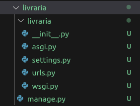
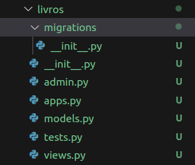
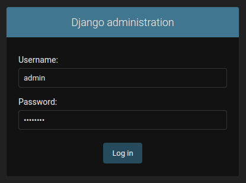
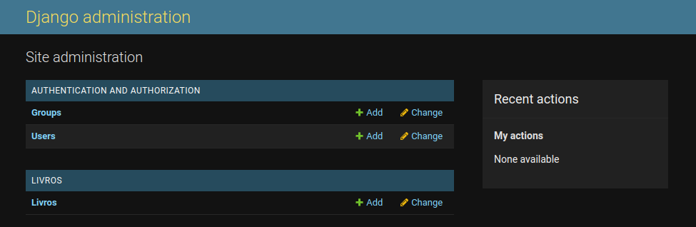
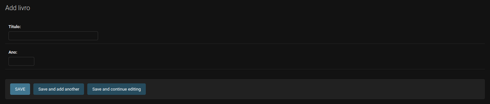
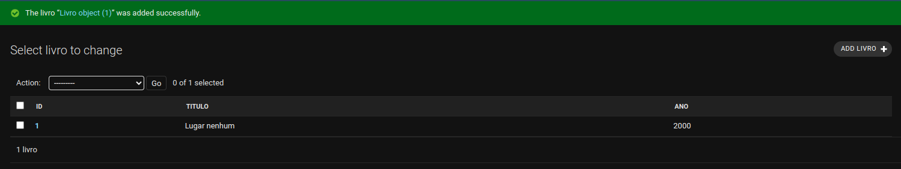
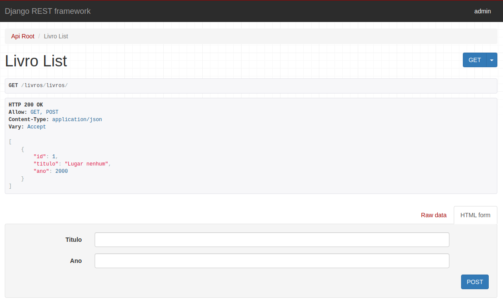
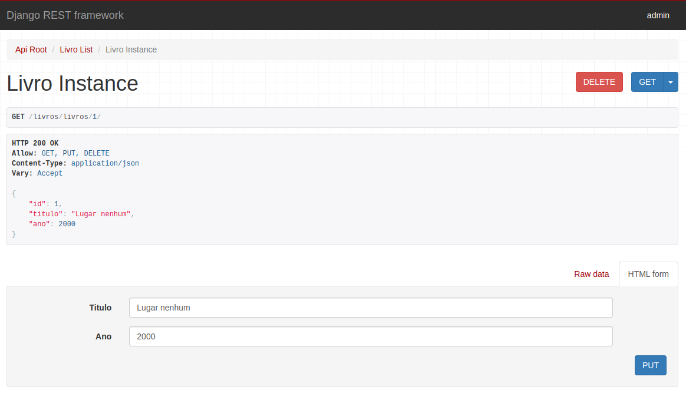

# Aula 13

## Django

É um framwork open source, de alto nível, focado no desenvolvimento web com Python.

- https://www.djangoproject.com/.

Ele foi criado para ajudar o desenvolvedor a construir aplicações da maneira mais rápido possível.

Ele conta com uma comunidade muito ativa. É muito fácil encontrar tutoriais e bibliotecas que adicionam funcionalidades extra para o framework.

Neste tutorial oficial do Django, é possível encontrar um passo a passo para contruir uma aplicação: https://docs.djangoproject.com/en/4.2/intro/tutorial01/.

O Django vem com várias ferramentas para facilitar o desenvolvimento:

- ORM (Object Relational Mapper): da mesma maneira que o Sql Alchemy (biblioteca que instalamos no projeto Flask), o ORM do Django nos permite interagir com o banco de dados de maneira alto nível, utilizando classes, sem a necessidade de escrever SQL.

- Admin: uma interface que permite fazer o CRUD das tabelas do banco de dados, além de fazer cadastro e gerenciamento de usuários, entre outras possibilidades.

- Autenticação de autorização: o Django já implementa o cadastro de usuários e grupos de acesso. Cada vez que você cria uma nova tabela pelo Django, automaticamente são criadas permissões para criar, visualizar, atualizar e excluir aquele tipo de objeto. Desta forma, estas permissões podem ser vinculadas a usuários e grupos específicos que poderão acessar o objeto.

- Templates: o Django também permite criar páginas HTML que interagem facilmente com os objetos do backend, permitindo criar um "fronted" rapidamente para a aplicação.

- Testes: ferramentas para criar e executar testes automatizados.

## Django rest framework (DRF)

É uma biblioteca que facilita muito o desenvolvimento de APIs com Django (semelhante ao que Flask Restful, que usamos no projeto Flask).

- https://www.django-rest-framework.org/.

## Projeto da livraria utilizando o Django

Nesta aula, vamos estudar as funcionalidades do Django, replicando o mesmo projeto da livraria, que fizemos com Flask.

### Criando o projeto

O primeiro passo é instalar o Django:

```different
python -m pip install Django
```

O comando irá instalar a versão mais recente do framework.

Depois, na pasta desejada, execute o comando para criar um novo projeto Django para a livraria:

```different
django-admin startproject livraria
```

A seguinte estrutura de arquivos será criada:



A pasta mais externa "livraria" é simplesmente a pasta que guarda o projeto e pode ser seu nome alterado se desejado.

A pasta mais interna "livraria" é o Python package do projeto (veja que contém o __ init __.py). Dentro dele teremos os arquivos:

- asgi.py: utilizado quando formos subir a aplicação em um servidor compatível com ASGI.

- settings.py: confgurações do projeto. Aqui vamos especificar idioma do projeto, variáveis do banco de dados (usuário, senha, etc), urls que poderão acessar a aplicação, entre outras configurações.

- urls.py: mapeamento das urls, como faziamos no main.py do flask. Aqui fica em um arquivo separado.

- wsgi.py: utilizado quando formos subir a aplicação em um servidor compatível com WSGI.

O manage.py é um arquivo que permite executar comandos para interagir com a aplicação, como executar o projeto, executar testes, iniciar um terminal específico para interagir com o ORM, entre outros.

Com esta estrutura criada, e estando dentro da pasta mais externa "livraria", nós podemos executar o comando para rodar a aplicação: `python manage.py runserver`.

Se tudo der certo, ela deve ficar disponível na url http://127.0.0.1:8000/. Ao acessar a url você deve ver a mensagem: The install worked successfully! Congratulations!

### Criando um app
Um projeto é composto por vários apps. Normalmente um app é usado para reperesentar um domínio da aplicação. No caso da livraria podemos pensar em alguns domínios: 

- livros: incluindo as tabelas de livros, autores e editoras;

- clientes: incluindo tabelas de clientes, contatos e endereços;

- pedidos: tabelas de pedidos e cupons, por exemplo.

Para começar, vamos criar o app "livros": `python manage.py startapp livros`.

Também será necessário adicionar o novo app no settings.py:

```python
...
INSTALLED_APPS = [
    'django.contrib.admin',
    'django.contrib.auth',
    'django.contrib.contenttypes',
    'django.contrib.sessions',
    'django.contrib.messages',
    'django.contrib.staticfiles',
    'livros',  # novo app
]
...
```

O app vai ter a estrutura:



- migrations: quando criarmos ou alterarmos uma classe que representa uma tabela, vamos precisar rodar um comando que irá gerar um arquivo de migration, que representará as operações que iremos fazer no banco de dados. Veremos mais detalhamente ao utilizar.

- admin.py: aqui poderemos registrar as tabelas criadas para que apareçam no painel do admin. Por enquanto estará vazio.

- apps.py: arquivo de configuração do app.

- models.py: aqui vamos criar as classes que representam as tabelas, como faziamos, por exemplo, no arquivo livros.py. Por enquanto estará vazio.

- tests.py: aqui podemos criar testes automatizados. Por enquanto está vazio.

- views.py: aqui serão criados os métodos de get, post, put e delete, semelhante ao que faziamos no resources.py. Por enquanto está vazio.

### Criado os models do app livro

No arquivo models.py:

```python
from django.db import models


# Flask
# class Livro(db.Model):
#     __tablename__ = 'livro'
#
#     livro_id = db.Column(db.Integer, primary_key=True)
#     titulo = db.Column(db.String(255))
#     ano = db.Column(db.Integer)
#     autor_id = db.Column(db.Integer, db.ForeignKey('autor.autor_id'))

class Livro(models.Model):
    # o id é gerado automaticamente
    titulo = models.CharField(max_length=255)
    ano = models.IntegerField()
    # autor_id será adicionado depois
```

### Registrando os models no admin

No arquivo admin.py:

```python
from django.contrib import admin

from livros.models import Livro


@admin.register(Livro)
class LivroAdmin(admin.ModelAdmin):
    # campos que vão aparecer na listagem
    list_display = ('id', 'titulo', 'ano')
```

Depois de adicionar o app no settings.py e registrar a tabela no admin.py, é necessário rodar o comando: `python manage.py makemigrations`.

Isso vai gerar automaticamente um novo arquivo no package migrations do app livros, chamado 0001_initial.py, com o conteúdo:

```python
# Generated by Django 4.1.7 on 2023-06-11 18:17

from django.db import migrations, models


class Migration(migrations.Migration):

    initial = True

    dependencies = [
    ]

    operations = [
        migrations.CreateModel(
            name='Livro',
            fields=[
                ('id', models.BigAutoField(auto_created=True, primary_key=True, serialize=False, verbose_name='ID')),
                ('titulo', models.CharField(max_length=255)),
                ('ano', models.IntegerField()),
            ],
        ),
    ]
```

É possível ver que mesmo não especificando o id no model.py, ele é gerado automaticamente como uma primary key.

Neste ponto, as alterações em banco representadas neste arquivo ainda não foram aplicadas. Para que isso aconteça é necessário rodar o comando: `python manage.py migrate`.

Ao rodar este comando, a tabela será criada no banco de dados. Como não configuramos nenhum banco até este momento, será usado o Sqlite por padrão.

Vamos executar o comando: `python manage.py createsuperuser`. 

Ele permite criar um usuário administrador para acessar o painel admin do Django, basta informar os dados solicitados: username, e-mail (não será enviado nenhum e-mail nesse por enquanto, pode ser qualquer um) e password. Para acessar o painel admin, acesar a url http://127.0.0.1:8000/admin, que irá redirecionar para a tela de login:



Após logar já é possível ver a tabela dos livros:



Clicando na tabela Livros, pelo botão "ADD LIVRO +" aparecerá um formulário para cadastrar um livro novo:



Os campos especificados no admin.py vão aparecer na listagem:



### Criando as views do app livro

Primeiramente vamos instalar a biblioteca Django rest framwork, que vai facilitar bastante a criação das views. Devemos estar com a venv ativa e rodar o comando: `pip install djangorestframework`.

Também será necessário adicionar o app do Django rest framework no settings.py:

```python
...
INSTALLED_APPS = [
    'django.contrib.admin',
    'django.contrib.auth',
    'django.contrib.contenttypes',
    'django.contrib.sessions',
    'django.contrib.messages',
    'django.contrib.staticfiles',
    'rest_framework',  # app do DRF
    'livros',
]
...
```

Antes de criar os métodos para os endpoints preciamos definir o serializer do livro (semelhante ao método serialize() da classe livro do projeto Flask). No Django ele não será um método, será uma classe. Vamos criá-lo em views.py:

```python
from rest_framework import serializers

from livros.models import Livro


class LivroSerializer(serializers.ModelSerializer):
    class Meta:
        model = Livro
        # campos que queremos serializar
        fields = ('id', 'titulo', 'ano')
```

Com o serializer criado já é possível criar a view:

```python

from rest_framework import serializers
from rest_framework import viewsets

from livros.models import Livro


class LivroSerializer(serializers.ModelSerializer):
    class Meta:
        model = Livro
        # campos que queremos serializar
        fields = ('id', 'titulo', 'ano')


class LivroView(viewsets.ModelViewSet):
    queryset = Livro.objects.all() # filtra todos os livros
    serializer_class = LivroSerializer # classe de serializer que será usada  
    http_method_names = ['get', 'post', 'put', 'delete']  # métodos http permitidos
```

### Mapeando as urls do app

No app livros será necessário criar um arquivo chamado urls.py com o conteúdo:

```python
from django.urls import path, include
from rest_framework import routers

from livros.views import LivroView


router = routers.DefaultRouter()
router.register('livros', LivroView)  # nome do objeto da view

urlpatterns = [
    path('livros/', include(router.urls)),  # nome do app
]
```

Desta maneira teremos definido o endpoint http://127.0.0.1:8000/livros/livros/ (get, post, put e delete), onde o primeiro "livros" é referente ao nome do app e o segundo é referente ao objeto livro.

Da mesma forma, futuramente podemos ter:
- http://127.0.0.1:8000/livros/autores
- http://127.0.0.1:8000/livros/editoras

Para isso iremos registrar no router as views dos autores e editoras:

```python
...
router = routers.DefaultRouter()
router.register('livros', LivroView)  # nome do objeto da view
router.register('autores', AutorView)  # nome do objeto da view
router.register('editoras', EditoraView)  # nome do objeto da view


urlpatterns = [
    path('livros/', include(router.urls)),  # nome do app
]
...
```

No urls.py que já existe no package "livaria", será necessário incluir as urls do app livros:

```python
from django.contrib import admin
from django.urls import path, include


urlpatterns = [
    path('admin/', admin.site.urls),
    path('', include('livros.urls')),  # incluir urls do app livros
]
```

Após estes passos, ao acessar a url http://127.0.0.1:8000/livros/livros/ teremos acesso a uma documentação gerada automaticamente pelo próprio DRF, onde vamos conseguir fazer as opções GET todos e POST:



Acessando http://127.0.0.1:8000/livros/1 ou qualquer id existente, vamos ter acesso ao GET, PUT e DELETE:



Isto é possível pois a classe que LivroView herda é a ModelViewSet e ela implementa os métodos:
- create() - POST
- list - GET todos
- retrieve - GET por id
- update - PUT
- delete - DELETE

Vamos dar uma olhada no retrieve, por exemplo:

```python
class RetrieveModelMixin:
    """
    Retrieve a model instance.
    """
    def retrieve(self, request, *args, **kwargs):
        instance = self.get_object()
        serializer = self.get_serializer(instance)
        return Response(serializer.data)
```

Ele recupera o objeto relacionado ao id enviado na url, a partir do método get_object() e salva na variável instance. Depois ele recupera a classe de serializer que especificamos na view e utiliza para serializar os dados de instance. Por fim, retorna os dados como um objeto da classe Response(), que retorna um json juntamente com um status code (e erros se houverem). 

Caso precisemos de algum comportamento específico, os métodos padrão podem ser sobreescritos na view.
