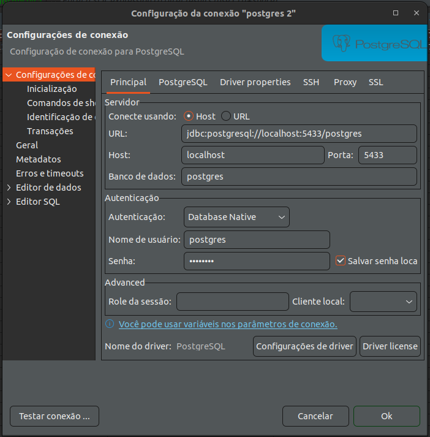
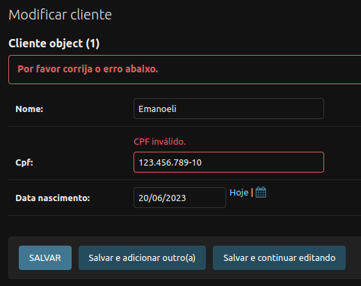

# Aula 14

## Criando um arquivo .env

Algumas variáveis estão diretamente no arquivo de settings.py, como é o caso da SECRET_KEY. Este é um exemplo de variável que não deve ficar fixa no código. O Django utiliza esta variável para fins de criptografia e deixar ela exposta pode fazer com que pessoas mal intencionadas a utilizem para gerar um token de acesso para a API, por exemplo.

Esta e outras variáveis podem ser armazenadas em um arquivo separado, que é acessado pelo settings.py, um arquivo chamado .env:

```different
SECRET_KEY = 'django-insecure-key'
```

Quando o projeto estiver rodando localmente, o Django irá pegar as variáveis desse arquivo .env. Quando estiver rodando em um servidor, o servidor poderá ser condigurado para guardar essas variáveis.

Vamos instalar esta biblioteca que vai facilitar para ler as variáveis no settings.py: https://pypi.org/project/python-decouple/

```different
pip install python-decouple
```

No ínicio do settings.py será ncessário fazer o import:

```python
from decouple import config
```

E no lugar da variável fixa, vamos deixar:

```python
SECRET_KEY = config('SECRET_KEY')  # mesmo nome que está no arquivo .env
```

O projeto deve rodar normalmente após esse ajuste.

Além disso é necessário proteger o arquivo .env para que ele não seja enviado para um repositório git. Para isto utilizamos um arquivo chamado .gitignore.

Neste repositório do curso já temos um. Vamos adicionar o nome do arquivo .env nele:

```different
.venv/
__pycache__/
.env
```

Ele já contem algumas outras linhas que indicam que não seja enviada a pasta da .venv e também pastas __ pycache __, que são geradas após a compilação. Os arquivos descritos neste arquivo não serão enviados ao fazer um "git commit" para enviar as alterações do projeto para um repositório.

## Criando um arquivo requirements.txt

O número de bibliotecas que usamos vem aumentando. Para evitar ter que instalar cada uma delas manualmente podemos criar um arquivo de requirements. Não precisamos criar este arquivo manualmente. O comando abaixo vai fazer isso para nós:

```different
pip freeze > requirements.txt
```

Um arquivo será gerado, contendo todas as bibliotecas que foram instaladas na .venv. Exemplo (aqui também estão a do projeto Flask, pois estou usando o mesmo repositório e .venv para todas as aulas):

```different
aniso8601==9.0.1
asgiref==3.7.2
attrs==23.1.0
blinker==1.6.2
click==8.1.3
Django==4.2.2
django-rest-framework==0.1.0
djangorestframework==3.14.0
flasgger==0.9.7.1
Flask==2.3.2
Flask-RESTful==0.3.10
Flask-SQLAlchemy==3.0.3
greenlet==2.0.2
itsdangerous==2.1.2
Jinja2==3.1.2
jsonschema==4.17.3
MarkupSafe==2.1.2
mistune==2.0.5
packaging==23.1
psycopg2-binary==2.9.6
pyrsistent==0.19.3
python-decouple==3.8
pytz==2023.3
PyYAML==6.0
six==1.16.0
SQLAlchemy==2.0.15
sqlparse==0.4.4
typing_extensions==4.6.2
Werkzeug==2.3.4
```

Nem todas foram instalada por nós, algumas são instaladas automaticamente, como dependência de alguma biblioteca que instalamos.

Se a .venv for apagada e criada novamente, bastante executar o seguinte comando para instalar todas as dependências novamente:

```
pip install -r requirements.txt
```

## Utilizando o banco Postgres

Primeiramente vamos criar um banco, pelo docker, por exemplo:

```different
docker run --name pg-django -p 5433:5432 -e POSTGRES_PASSWORD=postgres postgres
```

Antes de configurar o banco será necessário instalar uma biblioteca para conexão com o Postgres:

```different
pip install psycopg2-binary
```

Depois disso podemos atualizar o requirements:

```
pip install -r requirements.txt
```

No arquivo settings.py vamos atualizar a variável DATABASES:

```python
DATABASES = {
    'default': {
        'ENGINE': 'django.db.backends.postgresql',
        'NAME': config('DATABASE_NAME'),
        'USER': config('DATABASE_USER'),
        'PASSWORD': config('DATABASE_PASSWORD'),
        'HOST': config('DATABASE_HOST'),
        'PORT': config('DATABASE_PORT', default='5432'),
    }
}
```

E no .env adicionar as variáveis:

```different
DATABASE_NAME = postgres
DATABASE_USER = postgres
DATABASE_PASSWORD = postgres
DATABASE_HOST = 127.0.0.1
DATABASE_PORT = 5433
```

Vai ser necessário rodar novamente as migrations: `python manage.py migrate`.

Para acessar o banco novo pelo DBeaver, configurar uma nova conexão conforme abaixo:



Após conectar, verificar se as tabelas do livro e do autor foram criadas corretamente.

Lembre-se também de criar o usuário admin novamente: `python manage.py createsuperuser`

## Documentação formato swagger

A documentação pode ser gerada facilmente com a lib abaixo (atualizar o requirements.txt depois):

```different
pip install drf-yasg
```

Ela precisa estar nos INSTALLED_APPS:

```python
INSTALLED_APPS = [
    'django.contrib.admin',
    'django.contrib.auth',
    'django.contrib.contenttypes',
    'django.contrib.sessions',
    'django.contrib.messages',
    'django.contrib.staticfiles',
    'rest_framework',
    'drf_yasg',
    'livros',
]
```

Também vamos precisar adicionar esta linha logo abaixo de STATIC_URL:

```python
STATIC_URL = 'static/'
STATIC_ROOT = 'staticfiles'  # nova linha
```

E rodar o comando `python manage.py collectstatic`. Ele é necessário para gerar os arquivos de html, css e js para gerar a tela do swagger. Eles vão ficar em uma nova pasta chamada staticfiles. É importante adicionar ela no .gitignore para que não suba todos esses arquivos para o repositório:

```different
.venv/
__pycache__/
.env
staticfiles
```

Também vamos precisar adicionar as urls do swagger no arquivo principal de urls, que ficará da seguinte forma:

```python
from drf_yasg import openapi  # novo import
from drf_yasg.views import get_schema_view  # novo import
from django.contrib import admin
from django.urls import path, include
from rest_framework import permissions


# especificações do swagger
schema_view = get_schema_view(
    openapi.Info(
        title='Livraria API',
        default_version='v1',
    ),
    public=True,
    permission_classes=[permissions.AllowAny],
)


urlpatterns = [
    path('admin/', admin.site.urls),
    path('', include('livros.urls')),
    # urls do swagger
    path('api/swagger.<slug:format>)', schema_view.without_ui(cache_timeout=0), name='schema-json'),
    path('api/swagger/', schema_view.with_ui('swagger', cache_timeout=0), name='schema-swagger-ui'),
]
```

Feito isso, uma documentação semelhante à do projeto Flask estará disponível em: http://127.0.0.1:8000/api/swagger/. Não precisamos adicionar docstring manualmente em cada método. Ele já reconhece os campos a partir dos serializers. Ele também já monta os status code padrão de sucesso do DRF.

## APP clientes

Criar novo app: `python manage.py startapp clientes`

Adicionar nos INSTALLED_APPS:

```python
...
    'drf_yasg',
    'livros',
    'clientes',
]
```

Criar a model:

```python
from django.db import models


class Cliente(models.Model):
    nome = models.CharField(max_length=255)
    cpf = models.CharField(max_length=14)  # com a máscara
    data_nascimento = models.DateField()
```

Adicionar no admin:

```python
from django.contrib import admin


from clientes.models import Cliente


@admin.register(Cliente)
class ClienteAdmin(admin.ModelAdmin):
    list_display = ('id', 'nome', 'cpf', 'data_nascimento')
```

Rodar as migrations: `python manage.py makemigrations` e `python manage.py migrate`. A tabela dos clientes já deve aparecer no admin.

Criar o serializer e a view:

```python
from rest_framework import serializers
from rest_framework import viewsets

from clientes.models import Cliente


class ClienteSerializer(serializers.ModelSerializer):
    class Meta:
        model = Cliente
        fields = ('id', 'nome', 'cpf', 'data_nascimento')


class ClienteView(viewsets.ModelViewSet):
    queryset = Cliente.objects.all() 
    serializer_class = ClienteSerializer 
    http_method_names = ['get', 'post', 'put', 'delete']  
```

Criar arquivo urls.py

```python
from django.urls import path, include
from rest_framework import routers

from clientes.views import ClienteView


router = routers.DefaultRouter()
router.register('clientes', ClienteView)

urlpatterns = [
    path('clientes/', include(router.urls)),
]
```

Adicionar nas urls principais:

```python
...
urlpatterns = [
    path('admin/', admin.site.urls),
    path('', include('livros.urls')),
    path('', include('clientes.urls')),  # nova url
    path('api/swagger.<slug:format>)', schema_view.without_ui(cache_timeout=0), name='schema-json'),
    path('api/swagger/', schema_view.with_ui('swagger', cache_timeout=0), name='schema-swagger-ui'),
]
...
```

Os endpoints já devem aparecer no swagger.

## Validações

Vamos criar um package chamado utils, igual ao do projeto Flask. Não vamos ter models, então não precisa ser um app. Neste package vamos ter o arquivo utils.py:

```python
def _retorna_digitos(texto):
    if not texto or not isinstance(texto, str):
        return None
    return ''.join([c for c in texto if c.isdigit()])

def valida_cpf(cpf):
    cpf = _retorna_digitos(cpf)
    if not cpf or len(cpf) != 11:
        return False

    # Primeiro dígito
    relacao_digito_peso = zip(
        [int(digito) for digito in cpf[0:-2]], [peso for peso in range(10, 1, -1)])
    resto_soma = sum(
        [digito * peso for digito, peso in relacao_digito_peso]) % 11
    digito_esperado = 11 - resto_soma if resto_soma >= 2 else 0
    if cpf[-2] != str(digito_esperado):
        return False

    # Segundo dígito
    relacao_digito_peso = zip(
        [int(digito) for digito in cpf[0:-1]], [peso for peso in range(11, 1, -1)])
    resto_soma = sum(
        [digito * peso for digito, peso in relacao_digito_peso]) % 11
    digito_esperado = 11 - resto_soma if resto_soma >= 2 else 0
    if cpf[-1] != str(digito_esperado):
        return False

    return True


def mascara_cpf(cpf):
    if valida_cpf(cpf):
        cpf = _retorna_digitos(cpf)
        return f'{cpf[:3]}.{cpf[3:6]}.{cpf[6:9]}-{cpf[9:11]}'
    return None
```

É possível especificar no próprio model uma validação para um campo através do parâmetro validators. Fica bem parecido com o que fizemos no Flask:

```python
from django.db import models
from django.core.exceptions import ValidationError

from utils.utils import valida_cpf, mascara_cpf


def validator_cpf(value):
    if not valida_cpf(value):
        raise ValidationError('CPF inválido.')
    return mascara_cpf(value)


class Cliente(models.Model):
    nome = models.CharField(max_length=255)
    cpf = models.CharField(max_length=14, validators=[validator_cpf])  # com a máscara
    data_nascimento = models.DateField()
```

Agora, ao tentar fazer um cadastro com cpf inválido pela API, deve ser mostrado um erro:

```json
{
  "cpf": [
    "CPF inválido."
  ]
}
```

Mas o tratamento também será aplicado aos cadastros via admin:



Vamso atualizar também o método str do model para apresentar os dados de maneira mais amigável no admin:

```python
    def __str__(self) -> str:
        return f'{self.nome} - {self.cpf}'
```

A data já é validade automaticamente, por ter sido definida como DateField. O mesmo aconteceria com um campo de e-mail, pois o Django já disponibiliza um EmailField, vamos adicionar:

```python
...
class Cliente(models.Model):
    nome = models.CharField(max_length=255)
    cpf = models.CharField(max_length=14, validators=[validator_cpf])  # com a máscara
    data_nascimento = models.DateField()
    email = models.EmailField(null=True, blank=True)
...
```

Precisamos lembrar de adicionar o campo email no list_display do admin, no ClienteSerializer e também rodar o makemigrations e o migrate.

Ao tentar cadastrar um email inválido (ex.: "email": "user@example") o erro será apresentado:

```python
{
  "email": [
    "Insira um endereço de email válido."
  ]
}
```


