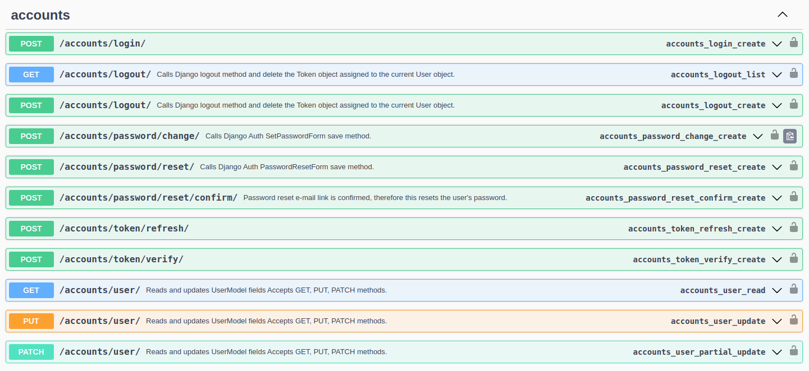

# Aula 19

## Libs para gerenciamento de usuários

Na aula passada criamos um endpoint bem simples para cadastrar novos usuários. 

Hoje vamos utilizar duas bibliotecas que permitem fazer isso de maneira mais fácil, além de fornecerem endponts para:
- Verificar e-mail cadastrado;
- Recuperar senha;
- Trocar senha.

São as bibliotecas **dj-rest-auth** e **django-allauth**. Esta última também permite fazer login usando outros provedores como facebook, twitter, discord, gmail e muitos outros.

Para instalar as duas em conjunto, rodar o comando `pip install 'dj-rest-auth[with_social]'`. Não esquecer de rodar o `pip freeze > requirements.txt`.

Nos ISTALLED_APPS, adicionar:

```python
    ...
    'rest_framework.authtoken'
    'dj_rest_auth',
    'allauth',
    'allauth.account',
    'allauth.socialaccount',
    'dj_rest_auth.registration',
    ...
```

Também será nescessária as novas variáveis no settings:

```python
...
SITE_ID = 1

REST_AUTH = {
    'USE_JWT': True,
    'JWT_AUTH_HTTPONLY': False,
}
```

Agora vamos excluir a nossa view de cadastro de usuário, assim como sua url, pois não será mais usada. É o arquivo views.py do utils e a linha
"path('sign-up/', SignUpView.as_view(), name='sign_up')," das urls.

As duas urls abaixo:

```python
    ...
    path('api/token/', jwt_views.TokenObtainPairView.as_view(), name='token_obtain_pair'),
    path('api/token/refresh/', jwt_views.TokenRefreshView.as_view(), name='token_refresh'),
    ...
```

Podem ser substituidas por:

```python
    ...
    path('accounts/', include('dj_rest_auth.urls')),
    ...
```

Será necessário rodar um `python manage.py migrate` após configurar as novas bibliotecas, pois elas criam algumas tabelas no banco.

Depois, ao acessar o swagger, você já poderá ver novos endpoints:



Todos eles são criados automaticamente para nós através das libs. O endpoint 
accounts/login é o endpoint que irá gerar o access token, enquanto o endpoint accounts/token/refresh irá fornecer o refresh token.

Ao fazer o login, o json de exemplo será:

```json
{
  "username": "string",
  "email": "user@example.com",
  "password": "string"
}
```

Sendo que é possível logar tanto com username quanto e-mail, é necessário informar somente um dos dois.

Vamos testar alguns outros enpoints bem úteis fornecidos pelas libs. Para isso gere um access token e preencha no swagger.

## Troca de senha

Vamos testar o endpoint POST accounts/password/change/. Estando devidamente logado com um token válido, você pode usar este endpoint para trocar sua senha. É necessário informar a senha duas vezes.

Se as duas senhas forem iguais e atenderem os requisitos de segurança, você terá a mensagem:

```json
{
  "detail": "Nova senha foi salva com sucesso."
}
```

Agora tente fazer login novamente com as credenciais atualizadas.

## Recuperação de senha

É feita pelo endpoint POST accounts/password/reset. Ele o um e-mail do usuário e então envia um e-mail de recuperação. Vamos simular o envio de e-mail pelo Django. Para isso vamos configurar no settings:

```python
EMAIL_BACKEND = "django.core.mail.backends.console.EmailBackend"
```

Para testar este endpoint você não deve estar logado.

Ao fazer o teste, mesmo preenchendo meu e-mail corretamente, tenho o seguinte erro:

```different
django.urls.exceptions.NoReverseMatch: Reverse for 'password_reset_confirm' not found. 'password_reset_confirm' is not a valid view function or pattern name.
```

Talvez seja um problema na lib, mas adicionando a seguinte url o problema é resolvido:

```python
...
from dj_rest_auth.views import PasswordResetConfirmView
...
    path(
        'api/accounts/password/reset/confirm/<str:uidb64>/<str:token>',
        PasswordResetConfirmView.as_view(),
        name='password_reset_confirm',
    ),
```

Agora uma mensagem de sucesso aparece:

```json
{
  "detail": "E-mail de redefinição de senha foi enviado."
}
```

E no terminal do VSCode temos o "print" do e-mail de recuperação de senha:

```different
...
Olá do site 127.0.0.1:8000!

You're receiving this e-mail because you or someone else has requested a password for your user account.
It can be safely ignored if you did not request a password reset. Click the link below to reset your password.

http://127.0.0.1:8000/api/accounts/password/reset/confirm/1/brv2xj-e49b4c3b1fce743404f4b15103c918ee

Caso tenha esquecido, seu nome de usuário é admin.

Obrigado por usar o site 127.0.0.1:8000!
127.0.0.1:8000
-------------------------------------------------------------------------------
```

O e-mail contém um link para recuperação de senha. Quando for utilizado um frontend para a API este link pode ser alterado para redirecionar para uma página do front. Este link contém duas informações importantes: o uid do usuário que vai ter a senha recuperada e também um token. O uid é o "1" logo após o "confirm/" e o token é tudo o que está após o "1/".

Estes dados devem ser enviados no endpoint POST POST accounts/password/reset/confirm/, como no exemplo:

```json
{
  "new_password1": "senhanova123",
  "new_password2": "senhanova123",
  "uid": "1",
  "token": "brv2xj-e49b4c3b1fce743404f4b15103c918ee"
}
```

Se tudo der certo, a mensagem será:

```json
{
  "detail": "Senha foi redefinida com a nova senha."
}
```

E será possível logar com a senha nova.

Uma vez recuperada a senha o token gerado se torna inválido. 

## Cadastro de novos usuários

Esta parte é feita pela django-allauth e será necessário adicionar mais uma url:

```python
    ...
    path('accounts/registration/', include('dj_rest_auth.registration.urls')),
    ...
```

Dois endpoints novos vão aparecer no swagger:

- POST accounts/registration/
- POST accounts/registration/verify-email/

O primeiro permite criar um novo usuário. Caso esteja configurado (no momento não está), ao criar o usuário é enviado um e-mail para que a pessoa possa fazer a confirmação de e-mail. Esta é feita pelo segundo endpoint.

Cadastre um novo usuário, exemplo:

```json
{
  "username": "manu",
  "email": "manu@example.com",
  "password1": "arroz123",
  "password2": "arroz123"
}
```

Como a confirmação de e-mail não está habilitada, a resposta já ira retorna um access token, refresh token e dados do usuário para que ele já possa usar o sistema:

```json
{
  "access": "eyJhbGciOiJIUzI1NiIsInR5cCI6IkpXVCJ9...",
  "refresh": "eyJhbGciOiJIUzI1NiIsInR5cCI6IkpXVCJ9...",
  "user": {
    "pk": 6,
    "username": "manu",
    "email": "manu@example.com",
    "first_name": "",
    "last_name": ""
  }
}
```

Este usuário já deve aparecer no admin. Acesse também a tabela http://127.0.0.1:8000/admin/account/emailaddress/.

Ela é criada automaticamente ao fazero migrate após configuração das libs. Aqui você verá os e-mails de todos os usuários do sistema. O usuário recém cadastrado está com e-mail não verificado, pois o sistema não tinha esse requisito.

## Avidando verificação de e-mail ao registrar

Isto é feito adicionando duas novas variáveis no settings:

```python
...
ACCOUNT_EMAIL_REQUIRED = True
ACCOUNT_EMAIL_VERIFICATION = 'mandatory'
```

Agora, ao criar um novo usuário, será exibida a mensagem:

```json
{
  "detail": "E-mail de verificação enviado."
}
```

No terminal do VSCode, aparecerá:

```different
...
Olá do site 127.0.0.1:8000!

Você está recebendo essa mensagem porque o usuário manu2 utilizou este e-mail para se cadastrar no site 127.0.0.1:8000.

Para confirmar que isso está correto, clique em http://127.0.0.1:8000/accounts/registration/account-confirm-email/Mw:1qO6QP:I8mcxjK8Gr46uWA2MLqbn6plS9jZ8cesi4ROGu8F244/

Obrigado por usar o site 127.0.0.1:8000!
127.0.0.1:8000
-------------------------------------------------------------------------------
```

Novamente será apresentado um link que poderá ser ajustado futuramente para redirecionar para uma página do frontend. Este link contém uma key, que é tudo que está após "email/" (exceto a barra do final).

Antes de fazer a verificação do e-mail, tente fazer login no sistema.

Você deve ter o erro:

```json
{
  "non_field_errors": [
    "E-mail não foi verificado."
  ]
}
```

Agora verifique o e-mail. Para isso, a key deve ser enviada no endpoint POST accounts/registration/verify-email/:

```json
{
  "key": "Mw:1qO6QP:I8mcxjK8Gr46uWA2MLqbn6plS9jZ8cesi4ROGu8F244"
}
```

O retorno será:

```json
{
  "detail": "Ok"
}
```

Ao verificar a tabela http://127.0.0.1:8000/admin/account/emailaddress/ você verá que este usuário está com o e-mail verificado. Já é possível logar com o usuário.

Agora a API já está preparada para as funcionalidades indispensáveis:

- Registro de novos usuários;
- Confirmação de e-mail para novos usuários;
- Recuperação de senha;
- Troca de senha;
- Login (JWT).
