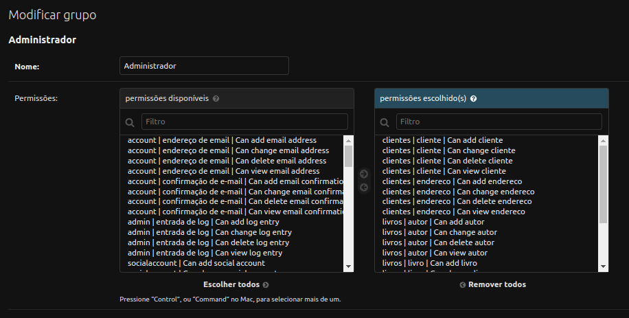

# Aula 20


## Aumentando tempo do token localmente

Para facilitar os testes localmente, podemos aumentar o tempo de duração do token:

```python
# Adicionar no .env uma variável ACCESS_TOKEN_LIFETIME com o tempo desejado (em minutos)
ACCESS_TOKEN_LIFETIME = config('ACCESS_TOKEN_LIFETIME', default=5, cast=int)
SIMPLE_JWT = {
    'ACCESS_TOKEN_LIFETIME': timedelta(minutes=ACCESS_TOKEN_LIFETIME),
}
```

## Endpoint de usuários

Vamos criar um endpoint com todos os usuários do sistema, que poderá ser utilizado por um administrador para listar usuários, ativar/inativar usuários, conceder permissões e etc. Vamos criar um novo app: `python manage.py startapp usuario`. Não esqueça de adicionar o novo app nos INSTALLED APPS.

O model do usuário já existe (é o padrão do Django), então vamos apenas criar as views e serializers:

```python
from rest_framework import serializers
from rest_framework import viewsets
from django.contrib.auth.models import User


class UsuarioSerializer(serializers.ModelSerializer):
    class Meta:
        model = User
        # remover campos que não devem ser retornados no serializer
        exclude = ['password', 'is_superuser', 'is_staff']


class UsuarioView(viewsets.ModelViewSet):
    queryset = User.objects.all() 
    serializer_class = UsuarioSerializer
    # a criação deve ser feita pelo endpoint de registro e não será possível excluir, apenas inativar
    http_method_names = ['get', 'put']  
```

Será necessário criar o arquivo das urls.py:

```python
from django.urls import path, include
from rest_framework import routers

from usuario.views import UsuarioView


router = routers.DefaultRouter()
router.register('usuarios', UsuarioView)  

urlpatterns = [
    path('usuarios/', include(router.urls)),
]
```

E adicionar no arquivo de urls principal:

```python
    ...
    path('', include('usuario.urls')),
    ...
```

Feito isso, os endpoints já aparecem no swagger e é possível fazer um get nos usuários:

```json
[
  {
    "id": 2,
    "last_login": null,
    "username": "emanoeli",
    "first_name": "emanoeli",
    "last_name": "madalosso",
    "email": "emanoeli.madalosso@gmail.com",
    "is_active": true,
    "date_joined": "2023-07-25T18:35:17-03:00",
    "groups": [],
    "user_permissions": [
      33,
      34,
      35,
      36
    ]
  },
  ...
```

Ao verificar os dados necessários para fazer o put, o swagger traz os seguintes campos:

```json
{
  "last_login": "2023-07-31T22:49:58.686Z",
  "username": "5YkOsdP9WBtyl+CBx-kPACmBfzwPghIPNVBIBQvG.esNDdJJCyKrsEeqe+2",
  "first_name": "string",
  "last_name": "string",
  "email": "user@example.com",
  "is_active": true,
  "date_joined": "2023-07-31T22:49:58.690Z",
  "groups": [
    0
  ],
  "user_permissions": [
    0
  ]
}
```

Alguns deles são interessantes de trazer no get, mas não faz sentido alterar, como last_login e data_joined. Por isso vamos deixar apenas como read only:

```python
class UsuarioSerializer(serializers.ModelSerializer):
    class Meta:
        model = User
        exclude = ['password', 'is_superuser', 'is_staff']
        read_only_fields = ['last_login', 'data_joined']
```

## Grupos e permissões

É possível ver que no endpoint do usuário já podemos retornar e atualizar os grupos ao qual ele pertence, porém ainda não fizemos o cadastro de grupos.

Vamos especificar 2 grupos:

- Administrador: pessoas que vão cadastrar clientes, endereços, livros, autores e cupons.
- Vendedor: pessoas que vão cadastrar clientes, endereços e pedidos.

Nós podemos criar os grupos e adcionar suas permissões de forma manual via Django admin, mas vamos aprender a fazer isto através de uma migration para popular dados. Assim já temos um exemplo a ser seguido quando for necessário. Este recurso pode ser usado sempre que precisarmos criar tabelas com dados padrão do sistema, que todos os clientes vão utilizar.

O primeiro passo é criar uma migration vazia através do comando `python manage.py makemigrations --empty usuario`. O último parâmetro é sempre o nome do app. Será criada uma migration vazia:

```python
# Generated by Django 4.2.2 on 2023-07-31 23:02

from django.db import migrations

class Migration(migrations.Migration):

    dependencies = [
    ]

    operations = [
    ]
```

Agora vamos criar uma função que cria os grupos e adiciona as permissões necessárias:

```python
# Generated by Django 4.2.2 on 2023-07-31 23:02

import sys

from django.db import migrations


def criar_grupos(apps, schema_editor):
    # evita de rodar essa função quando estiver rodando testes, assim não fica lento
    if 'test' in sys.argv:
        return

    # Em uma migration, os models sempre devem ser chamados com o get_model e não pelo import normal
    Group = apps.get_model('auth', 'group')
    Permission = apps.get_model('auth', 'permission')

    administrador = Group.objects.create(name='Administrador')
    perms_administrador = Permission.objects.filter(
        codename__in=[
            'add_cliente', 'change_cliente', 'view_cliente', 'delete_cliente',
            'add_endereco', 'change_endereco', 'view_endereco', 'delete_endereco',
            'add_livro', 'change_livro', 'view_livro', 'delete_livro',
            'add_autor', 'change_autor', 'view_autor', 'delete_autor',
            'add_cupom', 'change_cupom', 'view_cupom', 'delete_cupom',
        ]
    )
    administrador.permissions.add(*perms_administrador)

    vendedor = Group.objects.create(name='Vendedor')
    perms_vendedor = Permission.objects.filter(
        codename__in=[
            'add_cliente', 'change_cliente', 'view_cliente', 'delete_cliente',
            'add_endereco', 'change_endereco', 'view_endereco', 'delete_endereco',
            'add_pedido', 'change_pedido', 'view_pedido', 'delete_pedido',
        ]    
    )
    vendedor.permissions.add(*perms_vendedor)


class Migration(migrations.Migration):

    dependencies = [
    ]

    operations = [
        migrations.RunPython(criar_grupos)
    ]
```

Os models não devem ser importados como fazemos em um arquivo normal, precisa ser pelo get_model. Imagine que você está rodando as migrations em um banco novo, o banco de produção ou até mesmo no seu próprio computador após excluir um banco antigo e criar um novo. Imagine que em uma migration que foi criada após esta do grupo, você adicionou um novo atributo na model do User, chamado "empresa". Se você fizer um import normal, ao rodar a migration dos grupos, você poderá ter um erro, dizendo que o model User não possui a coluna empresa. Isto porque o import pega o estado atual do model, exatamente como está definido na classe. Com o get_model, você pega o estado do model no momento em que a migration está sendo rodada, ou seja, ainda antes de ter sido criado o campo empresa, então ele não irá interferir e nem dar erro.

Após recuperar os models da maneira adequada, criamos o grupo administrador. Depois filtramos no model Permission, todas as permissões que o grupo administrador poderá ter e adicionamos ao grupo. Fazemos o mesmo com o venddedor.

Em operations, rodamos a função que criamos através do comando migrations.RunPython(). Em dependecies não é necessário adicioanr nada, pois está é a priemira migration do app usuario.

Após rodar o comando `python manage.py migrate` os dados devem ser criados e você verá os dois novos grupos no admin em: 
http://127.0.0.1:8000/admin/auth/group/. Ao abrir um grupo, as permissões que configuramos devem aparecer do lado direito:

 

Agora você já pode vincular um usuário a um dos grupos (ou vários, mas para este exemplo vamos usar um). Ao fazer o get desse usuário, deve ser possível recuperar seu grupo:

```json
...
  {
    "id": 2,
    "last_login": "2023-07-24T22:38:21-03:00",
    "username": "emanoeli",
    "first_name": "emanoeli",
    "last_name": "madalosso",
    "email": "emanoeli.madalosso@gmail.com",
    "is_active": true,
    "date_joined": "2023-07-25T18:35:17-03:00",
    "groups": [
      3
    ],
    "user_permissions": [
      33,
      34,
      35,
      36
    ]
  },
...
```

O grupo 3 do exemplo, é o grupo vendedor. O usuário também já tinha algumas permissões adicionadas individualmente, que aparecem em user_permissions. 

Pode ser conveniente para o fronted retornar os nomes dos grupos e das permissões e não apenas os códigos. Vamos fazer esse ajuste. Vamos manter o serializer que já temos como o write serializer e vamos criar um novo para o read:

```python
from rest_framework import serializers
from rest_framework import viewsets
from rest_framework.permissions import SAFE_METHODS
from django.contrib.auth.models import User


class UsuarioWriteSerializer(serializers.ModelSerializer):
    class Meta:
        model = User
        exclude = ['password', 'is_superuser', 'is_staff']
        read_only_fields = ['last_login', 'data_joined']


class UsuarioReadSerializer(serializers.ModelSerializer):
    # sobre escrevemos os campos groups e user_permissions para poder customizar
    groups = serializers.SerializerMethodField()
    user_permissions = serializers.SerializerMethodField()

    class Meta:
        model = User
        exclude = ['password', 'is_superuser', 'is_staff']

    # métodos chamados de get_campo permitem alterar o valor que queremos retornar para o campo
    def get_groups(self, instance):
        # percorremos todos os grupos da instância e montamos uma lista com os nomes para retornar no lugar dos códigos
        group_names = []
        for group in instance.groups.all():
            group_names.append(group.name)
        return group_names
    
    def get_user_permissions(self, instance):
        # percorremos todas as permissões da instância e montamos uma lista com os nomes para retornar no lugar dos códigos
        perms_names = []
        for perm in instance.user_permissions.all():
            perms_names.append(perm.codename)
        return perms_names


class UsuarioView(viewsets.ModelViewSet):
    queryset = User.objects.all() 
    serializer_class = UsuarioReadSerializer
    # a criação deve ser feita pelo endpoint de registro e não será possível excluir, apenas inativar
    http_method_names = ['get', 'put']  

    # sobre escrevemos o get_serializer_class para poder alternar entre read e write
    def get_serializer_class(self):
        if self.request.method in SAFE_METHODS:
            return super().get_serializer_class()
        return UsuarioWriteSerializer
```

O retorno agora traz os nomes dos grupos e permissões, facilitando que o frontend futuramente possa bloquear telas para usuaŕios que não sejam de um determinado grupo ou não tenham determinadas permissões.

```json
  ...
  {
    "id": 2,
    "groups": [
      "Vendedor"
    ],
    "user_permissions": [
      "add_cliente",
      "change_cliente",
      "delete_cliente",
      "view_cliente"
    ],
    "last_login": "2023-07-24T22:38:21-03:00",
    "username": "emanoeli",
    "first_name": "emanoeli",
    "last_name": "madalosso",
    "email": "emanoeli.madalosso@gmail.com",
    "is_active": true,
    "date_joined": "2023-07-25T18:35:17-03:00"
  },
  ...
```

O grupo vendedor já possui permissões de cliente, mas elas foram adicionadas em user_permissions também, só para exemplificar, mas não seria necessário.

## Liberar views de acordo com as permissões

A classe de permissões que está configurada no settings é:

```python
REST_FRAMEWORK = {
    'DEFAULT_AUTHENTICATION_CLASSES': [
        'rest_framework_simplejwt.authentication.JWTAuthentication',
    ],
    'DEFAULT_PERMISSION_CLASSES': [
        'rest_framework.permissions.IsAuthenticated',  # ESSA
    ]
}
```

Ao alterar para:

```python
REST_FRAMEWORK = {
    'DEFAULT_AUTHENTICATION_CLASSES': [
        'rest_framework_simplejwt.authentication.JWTAuthentication',
    ],
    'DEFAULT_PERMISSION_CLASSES': [
        'rest_framework.permissions.DjangoModelPermissions',  # NOVA CLASSE
    ]
}
```

Um usuário do grupo vendedor pode, por exemplo, cadastrar clientes, pois ele tem a parmissão add_cliente. Mas caso ele tente cadastrar autores, não deve ser possível. Ele deve ter um erro, pois não possui a permissão add_autor:

```json
{
  "detail": "Você não tem permissão para executar essa ação."
}
```

Caso o mesmo usuário tente visualizar o autor, mesmo se for retirada a permissão view_autor do grupo, ele deve conseguir. Isso porque por padrão a classe DjangoModelPermissions deixa todos os endpoint "SAFE", ou de visualização, livres. 

Podemos entender este comportamento através do próprio código da classe DjangoModelPermissions:

```python
class DjangoModelPermissions(BasePermission):
    """
    The request is authenticated using `django.contrib.auth` permissions.
    See: https://docs.djangoproject.com/en/dev/topics/auth/#permissions

    It ensures that the user is authenticated, and has the appropriate
    `add`/`change`/`delete` permissions on the model.

    This permission can only be applied against view classes that
    provide a `.queryset` attribute.
    """

    # Map methods into required permission codes.
    # Override this if you need to also provide 'view' permissions,
    # or if you want to provide custom permission codes.
    perms_map = {
        'GET': [],
        'OPTIONS': [],
        'HEAD': [],
        'POST': ['%(app_label)s.add_%(model_name)s'],
        'PUT': ['%(app_label)s.change_%(model_name)s'],
        'PATCH': ['%(app_label)s.change_%(model_name)s'],
        'DELETE': ['%(app_label)s.delete_%(model_name)s'],
    }

    authenticated_users_only = True
```

Veja que o GET não tem nenhuma lista de permissões requeridas, enquanto métodos como POST e PUT tem. 

Caso você queira alterar este comportamento, por exemplo, apenas usuários com a permissão de view_model possam fazer o GET, é possível sobre escrever esta classe. É simples. No módulo utils vamos criar um arquivo permissions.py:

```python
from rest_framework.permissions import DjangoModelPermissions


class CustomDjangoModelPermissions(DjangoModelPermissions):
    perms_map = {
        'OPTIONS': [],
        'HEAD': [],
        'GET': ['%(app_label)s.view_%(model_name)s'],
        'POST': ['%(app_label)s.add_%(model_name)s'],
        'PUT': ['%(app_label)s.change_%(model_name)s'],
        'PATCH': ['%(app_label)s.change_%(model_name)s'],
        'DELETE': ['%(app_label)s.delete_%(model_name)s'],
    }

    # verifica se o usuário tem permissão para acessar a view de acordo com o método http solicitado
    # vamos manter o comportamento padrão
    def has_permission(self, request, view):
        return super().has_permission(request, view)

    # este método poderia ser sobreescrito no caso de um objeto livro, por exemplo, pertencer a uma filial x da livraria
    # e apenas usuários da filial x pudessem acessar o livro. Neste caso, livro e user teriam que ter uma fk de "empresa"
    # para fazer esta comparação.
    # vamos manter o padrão
    def has_object_permission(self, request, view, obj):
        return super().has_object_permission(self, request, view, obj)
```

No settings, vamos mudar a classe de permissões para a nossa customizada:

```python
REST_FRAMEWORK = {
    'DEFAULT_AUTHENTICATION_CLASSES': [
        'rest_framework_simplejwt.authentication.JWTAuthentication',
    ],
    'DEFAULT_PERMISSION_CLASSES': [
        'utils.permissions.CustomDjangoModelPermissions',  # CLASSE CUSTOMIZADA
    ]
}
```

Agora, se o usuário vendedor tentar fazer um GET em autor, por não ter a permissão view_autor, ele terá o erro:

```json
{
  "detail": "Você não tem permissão para executar essa ação."
}
```

## Atividade

Agora que vimos como criar uma migration que popula dados, crie uma migration que adiciona alguns autores no banco e depois outra migration que adiciona alguns livros no banco. Assim, você não precisará se preocuparar em ficar cadastrando estes dados manualmente quando estiver com um banco novo.