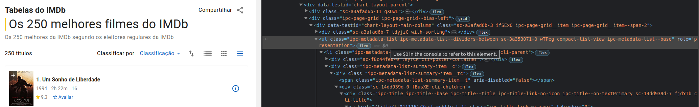
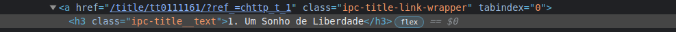
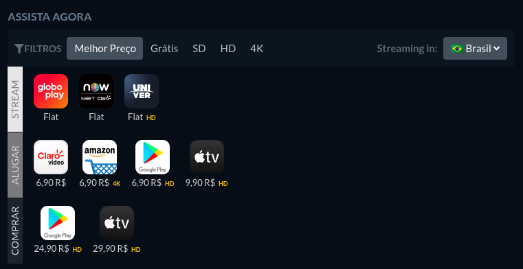
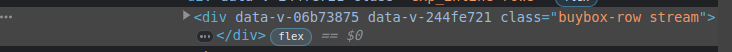
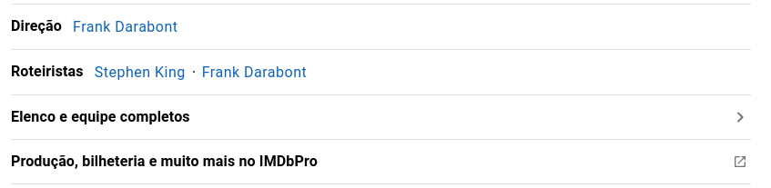

# Aula 21


## Web scraping

Vamos desenvolver um scrapper  que irá nos ajudar a ver filmes em casa. 

Ele irá recuperar os filmes do Top 250 do IMDB (https://www.imdb.com/chart/top/?ref_=nv_mv_250) e buscar links onde é possível ver cada um desses filmes no JustWatch (https://www.justwatch.com/).
 
Para isso vamos utilizar a biblioteca BeautifulSoup: `pip install beautifulsoup4`

Vamos iniciar fazendo uma request para a lista do IMDB e mostrando o html resultante:

```python
from bs4 import BeautifulSoup
import requests


url_imdb = 'https://www.imdb.com/chart/top/?ref_=nv_mv_250'
html = requests.get(url=url_imdb, headers={'User-Agent': 'Mozilla/5.0'}).content
soup = BeautifulSoup(html, 'html.parser')
print(soup.prettify())
```

O header com o User-Agent é importante para que o acesso seja identificado como vindo de um navegador e não um script, caso contrário irá retornar 403 (não autorizado).

A biblioteca BeautifulSoup possui algumas funções que pemitem encontrar elementos nesse html a partir de seu id ou mesmo a partir de uma classe. Muitos sites não tem id em todos os componentes, então é comum utilizar essa busca a partir das classes. Por exemplo:

```python
soup.find('div', class_='offer')
soup.find_all('div', class_='offer')
```

A primeira função encontra a primeira ocorrência de uma div com a class "offer". A segunda encontra todas, retornando uma lista.

Aqui estamos encontrando todas as divs que tenham a classe "offer". 

Vamos usar este recurso para encontrar no html o componente que tem a lista dos filmes. Inspecionando a página é possível ver que os filmes ficam em uma ul com diversas classes:



Uma destas classes que parece ser usada apenas nesta lista é "compact-list-view", então a partir dela podemos recuperar a lista de filmes:

```python
from bs4 import BeautifulSoup
import requests


url_imdb = 'https://www.imdb.com/chart/top/?ref_=nv_mv_250'
html = requests.get(url=url_imdb, headers={'User-Agent': 'Mozilla/5.0'}).content
soup = BeautifulSoup(html, 'html.parser')
# print(soup.prettify())
lista = soup.find('ul', class_='compact-list-view')
print(lista)
```

Já o título do filme está em um h3 com uma classe bem específica:



Então podemos obter da seguinte forma:

```python
...
lista = soup.find('ul', class_='compact-list-view')
titulos = lista.find_all('h3', class_='ipc-title__text')
for titulo in titulos:
    titulo = titulo.text.split('. ')[1]
    print('-----------------------------------------')
    print(titulo)
...
```

Ao fazer título.text, pegamos o texto que está no h3. Além de separar o título, o código faz o split através do ". " para separar o número do título.

A partir deste título já podemso consultar o filme no site JustWatch para saber em qual plataforma de streaming ele está disponível. Ao acessar o site e fazer uma busca, podemos perceber que o resultado vem em uma url do tipo: https://www.justwatch.com/br/filme/a-lista-de-schindler. Sendo assim, podemos usar o título do filme que acabamos de obter para montar a url. Será necessário um tratamento para deixar o título em lower case e também substituir os espaços por traços:

```python
...
lista = soup.find('ul', class_='compact-list-view')
titulos = lista.find_all('h3', class_='ipc-title__text')
for titulo in titulos:
    titulo = titulo.text.split('. ')[1]
    print('-----------------------------------------')
    print(titulo)

    titulo_tratado = titulo.lower().replace(' ', '-')
    print(titulo_tratado)
...
```

Feito o tratamento podemos montar a url e fazer a chamada, novamente pegando o html de retorno:

```python
from bs4 import BeautifulSoup
import requests


url_imdb = 'https://www.imdb.com/chart/top/?ref_=nv_mv_250'
url_just_watch = 'https://www.justwatch.com/br/filme/'  # URL principal

html = requests.get(url=url_imdb, headers={'User-Agent': 'Mozilla/5.0'}).content
soup = BeautifulSoup(html, 'html.parser')
# print(soup.prettify())

lista = soup.find('ul', class_='compact-list-view')
titulos = lista.find_all('h3', class_='ipc-title__text')
for titulo in titulos:
    titulo = titulo.text.split('. ')[1]
    print('-----------------------------------------')
    print(titulo)

    titulo_tratado = titulo.lower().replace(' ', '-')
    # print(titulo_tratado)
    
    url_busca = url_just_watch + titulo_tratado
    # print(url_busca)

    html = requests.get(url=url_busca, headers={'User-Agent': 'Mozilla/5.0'}).content
    soup = BeautifulSoup(html, 'html.parser')
    print(soup.prettify())
```

Ao abrir a página do filme, por ex.: https://www.justwatch.com/br/filme/a-lista-de-schindler, podemos ver que as plataformas são listadas aqui:



Existem 3 divisões: steream, alugar e comprar. Vamos listar apenas o que está na divisão "stream". Podemos fazer essa separação pela combinação de classes "buybox-row stream", conforme o print da inspeção da página:



Temos o seguinte código:

```python
    ...
    html = requests.get(url=url_busca, headers={'User-Agent': 'Mozilla/5.0'}).content
    soup = BeautifulSoup(html, 'html.parser')
    # print(soup.prettify())

    opcoes = soup.find('div', class_='buybox-row stream')
    print(opcoes)
    ...
```

Caso não sejam encontradas opções para assistir, vamos mostrar uma mensagem e continuar para o próximo filme. Caso as opções sejam encontradas, vamos extrair o link:

```python
    ...
    opcoes = soup.find('div', class_='buybox-row stream')
    # print(opcoes)

    if not opcoes:
        print('Não foram encontrados links para asistir.')
        continue

    for opcao in opcoes:
        links = opcao.find_all('a', class_='offer')
        for link in links:
            print(link['href'])
    ...
```

Ao executar o código (`python scrapper.py`), o resultado será do tipo:

```different
-----------------------------------------
12 Homens e uma Sentença
Não foram encontrados links para asistir.
-----------------------------------------
A Lista de Schindler
https://click.justwatch.com/a?r=https%3A%2F%2Fgloboplay.globo.com%2Fa-lista-de-schindler%2Ft%2FpJ2BCZqcJF%2F&cx=eyJzY2hlbWEiOiJpZ2x1OmNvbS5zbm93cGxvd2FuYWx5dGljcy5zbm93cGxvdy9jb250ZXh0cy9qc29uc2NoZW1hLzEtMC0wIiwiZGF0YSI6W3sic2NoZW1hIjoiaWdsdTpjb20uanVzdHdhdGNoL2NsaWNrb3V0X2NvbnRleHQvanNvbnNjaGVtYS8xLTItMCIsImRhdGEiOnsicHJvdmlkZXIiOiJHbG9ib3BsYXkiLCJwcm92aWRlcklkIjozMDcsIm1vbmV0aXphdGlvblR5cGUiOiJmbGF0cmF0ZSIsInByZXNlbnRhdGlvblR5cGUiOiJzZCIsImN1cnJlbmN5IjoiQlJMIiwicGFydG5lcklkIjoxfX1dfQ&uct_country=BR&uct_buybox=normal&uct_sport=&sid=&uct_ct=&uct_itsct=
https://click.justwatch.com/a?r=https%3A%2F%2Fwww.nowonline.com.br%2Ffilme%2Fa-lista-de-schindler%2F153082&cx=eyJzY2hlbWEiOiJpZ2x1OmNvbS5zbm93cGxvd2FuYWx5dGljcy5zbm93cGxvdy9jb250ZXh0cy9qc29uc2NoZW1hLzEtMC0wIiwiZGF0YSI6W3sic2NoZW1hIjoiaWdsdTpjb20uanVzdHdhdGNoL2NsaWNrb3V0X2NvbnRleHQvanNvbnNjaGVtYS8xLTItMCIsImRhdGEiOnsicHJvdmlkZXIiOiJOT1ciLCJwcm92aWRlcklkIjo0ODQsIm1vbmV0aXphdGlvblR5cGUiOiJmbGF0cmF0ZSIsInByZXNlbnRhdGlvblR5cGUiOiJzZCIsImN1cnJlbmN5IjoiQlJMIiwicGFydG5lcklkIjoxfX1dfQ&uct_country=BR&uct_buybox=normal&uct_sport=&sid=&uct_ct=&uct_itsct=
https://click.justwatch.com/a?r=https%3A%2F%2Fwww.univervideo.com%2Ffilmes%2Fa-lista-de-schindler&cx=eyJzY2hlbWEiOiJpZ2x1OmNvbS5zbm93cGxvd2FuYWx5dGljcy5zbm93cGxvdy9jb250ZXh0cy9qc29uc2NoZW1hLzEtMC0wIiwiZGF0YSI6W3sic2NoZW1hIjoiaWdsdTpjb20uanVzdHdhdGNoL2NsaWNrb3V0X2NvbnRleHQvanNvbnNjaGVtYS8xLTItMCIsImRhdGEiOnsicHJvdmlkZXIiOiJVbml2ZXIgVmlkZW8iLCJwcm92aWRlcklkIjoxODYwLCJtb25ldGl6YXRpb25UeXBlIjoiZmxhdHJhdGUiLCJwcmVzZW50YXRpb25UeXBlIjoiaGQiLCJjdXJyZW5jeSI6IkJSTCIsInBhcnRuZXJJZCI6MX19XX0&uct_country=BR&uct_buybox=normal&uct_sport=&sid=&uct_ct=&uct_itsct=
```

Ele pode demorar um pouco, pois estará fazendo um total de 500 chamadas.

Vamos incrementar o scrapper trazendo mais informações interessantes sobre os filmes, como por exemplo o link da página do filme:

```python
...
url_imdb = 'https://www.imdb.com'  # alteramos par aurl raíz do página
url_imdb_top_250 = url_imdb + '/chart/top/?ref_=nv_mv_250'  # criamos nova url do top 250
url_just_watch = 'https://www.justwatch.com/br/filme/'

html = requests.get(url=url_imdb_top_250, headers={'User-Agent': 'Mozilla/5.0'}).content
soup = BeautifulSoup(html, 'html.parser')
# print(soup.prettify())

lista = soup.find('ul', class_='compact-list-view')
titulos = lista.find_all('h3', class_='ipc-title__text')
links = lista.find_all('a', class_='ipc-title-link-wrapper')  # recuperamos também os links dos filmes
for titulo, link in zip(titulos, links):  # percorremos titulos e links ao mesmo tempo pela função zip
    titulo = titulo.text.split('. ')[1]
    link = url_imdb + link['href']
    print('-----------------------------------------')
    print(titulo)
    print(link)
...
```

Também podemos acessar os links para pegar detalhes mais específicos dos filmes, como a nota. Neste caso, o item perto da nota mais fácil de identifcar é a estrela:


Ela é um svg com a classe "ipc-icon--star". A partir do atributo .parent conseguimos pegar a div pai do componente que foi encontrado. Por isso no código abaixo encontramos a estrela e fazemos .parent duas vezes, para pegar o componente que abrange também o span da nota:

```python
    ...
    html = requests.get(url=link, headers={'User-Agent': 'Mozilla/5.0'}).content
    soup = BeautifulSoup(html, 'html.parser')
    # print(soup.prettify())

    svg = soup.find('svg', class_='ipc-icon--star')
    parent = svg.parent.parent
    nota = parent.find('span').text
    print(nota)
    ...
```

Agora vamos buscar o nome do diretor, que está neste componente:



A classe que podemos buscar é "ipc-metadata-list", que está em uma ul. Depois podemos pegar o primeiro "a" contendo a classe "ipc-metadata-list-item__list-content-item--link".

```python
    ...
    meta_data = soup.find('ul', class_='ipc-metadata-list')
    itens_meta_data = meta_data.find_all('a', class_='ipc-metadata-list-item__list-content-item--link')
    diretor = itens_meta_data[0].text
    print(diretor)
    ...
```

Para selecionar o elenco do filme, existe a classe "title-cast-item__avatar", usada pra montar o avatar da pessoa. Primeiro encontramos todos os avates da página e depois percorremos um a um. Para cada avatar, buscamos o próximo irmão pela função "find_next_sibling()", ou seja, o próximo componente que se encontra exatamente no mesmo nível (dentro da mesma div), que seria o nome do ator e personagem ao lado do avatar. A partir dai, sabemos que o nome do ator é um "a", um link que abre a página do ator, então pegamos o "text" de "a". 


```python
    ...
    atores = []
    avatares = soup.find_all('div', class_='title-cast-item__avatar')
    for avatar in avatares:
        dados_ator = avatar.find_next_sibling()
        ator = dados_ator.find('a').text
        atores.append(ator)
    print(atores)
    ...
```

Após alguns ajustes nos prints, devemos ter um resultado que nos ajude a decidir qual filme ver, não só de acordo com o ranking, mas tabém de acordo com diretores e atores que gostamos:

```different
-----------------------------------------
Título:  A Lista de Schindler
Link:  https://www.imdb.com/title/tt0108052/?ref_=chttp_t_6
Nota do público:  9.0
Diretor:  Steven Spielberg
Atores:  ['Liam Neeson', 'Ralph Fiennes', 'Ben Kingsley', 'Caroline Goodall', 'Jonathan Sagall', 'Embeth Davidtz', 'Malgorzata Gebel', 'Shmuel Levy', 'Mark Ivanir', 'Béatrice Macola', 'Andrzej Seweryn', 'Friedrich von Thun', 'Krzysztof Luft', 'Harry Nehring', 'Norbert Weisser', 'Adi Nitzan', 'Michael Schneider', 'Miri Fabian']
https://click.justwatch.com/a?r=https%3A%2F%2Fgloboplay.globo.com%2Fa-lista-de-schindler%2Ft%2FpJ2BCZqcJF%2F&cx=eyJzY2hlbWEiOiJpZ2x1OmNvbS5zbm93cGxvd2FuYWx5dGljcy5zbm93cGxvdy9jb250ZXh0cy9qc29uc2NoZW1hLzEtMC0wIiwiZGF0YSI6W3sic2NoZW1hIjoiaWdsdTpjb20uanVzdHdhdGNoL2NsaWNrb3V0X2NvbnRleHQvanNvbnNjaGVtYS8xLTItMCIsImRhdGEiOnsicHJvdmlkZXIiOiJHbG9ib3BsYXkiLCJwcm92aWRlcklkIjozMDcsIm1vbmV0aXphdGlvblR5cGUiOiJmbGF0cmF0ZSIsInByZXNlbnRhdGlvblR5cGUiOiJzZCIsImN1cnJlbmN5IjoiQlJMIiwicGFydG5lcklkIjoxfX1dfQ&uct_country=BR&uct_buybox=normal&uct_sport=&sid=&uct_ct=&uct_itsct=
https://click.justwatch.com/a?r=https%3A%2F%2Fwww.nowonline.com.br%2Ffilme%2Fa-lista-de-schindler%2F153082&cx=eyJzY2hlbWEiOiJpZ2x1OmNvbS5zbm93cGxvd2FuYWx5dGljcy5zbm93cGxvdy9jb250ZXh0cy9qc29uc2NoZW1hLzEtMC0wIiwiZGF0YSI6W3sic2NoZW1hIjoiaWdsdTpjb20uanVzdHdhdGNoL2NsaWNrb3V0X2NvbnRleHQvanNvbnNjaGVtYS8xLTItMCIsImRhdGEiOnsicHJvdmlkZXIiOiJOT1ciLCJwcm92aWRlcklkIjo0ODQsIm1vbmV0aXphdGlvblR5cGUiOiJmbGF0cmF0ZSIsInByZXNlbnRhdGlvblR5cGUiOiJzZCIsImN1cnJlbmN5IjoiQlJMIiwicGFydG5lcklkIjoxfX1dfQ&uct_country=BR&uct_buybox=normal&uct_sport=&sid=&uct_ct=&uct_itsct=
https://click.justwatch.com/a?r=https%3A%2F%2Fwww.univervideo.com%2Ffilmes%2Fa-lista-de-schindler&cx=eyJzY2hlbWEiOiJpZ2x1OmNvbS5zbm93cGxvd2FuYWx5dGljcy5zbm93cGxvdy9jb250ZXh0cy9qc29uc2NoZW1hLzEtMC0wIiwiZGF0YSI6W3sic2NoZW1hIjoiaWdsdTpjb20uanVzdHdhdGNoL2NsaWNrb3V0X2NvbnRleHQvanNvbnNjaGVtYS8xLTItMCIsImRhdGEiOnsicHJvdmlkZXIiOiJVbml2ZXIgVmlkZW8iLCJwcm92aWRlcklkIjoxODYwLCJtb25ldGl6YXRpb25UeXBlIjoiZmxhdHJhdGUiLCJwcmVzZW50YXRpb25UeXBlIjoiaGQiLCJjdXJyZW5jeSI6IkJSTCIsInBhcnRuZXJJZCI6MX19XX0&uct_country=BR&uct_buybox=normal&uct_sport=&sid=&uct_ct=&uct_itsct=
```
