# Aula 22

Neste aula vamos ver como salvar arquivos estáticos do Django e arquivo de mídia (imagens) no Amazon s3. 

Muitas plataformas, como por exemplo o Heroku, não fornecem armazenamento de arquivos.  Mesmo se usarmos um servidor próprio, salvar os arquivos no s3 é uma forma mais segura de manter estes arquivos devido a estabilidade e confiabilidade do serviço, além do baixo custo, já que é cobrado apenas o que é usado. 

## Configurando s3

1 - Criar uma conta na AWS (se for uma nova conta, você se enquadra no nível gratuito).

2 - Acessar a url https://s3.console.aws.amazon.com/s3 para criar um novo bucket.

### Criar bucket

1 - No botão alaranjado, você terá a opção de criar um novo bucket:

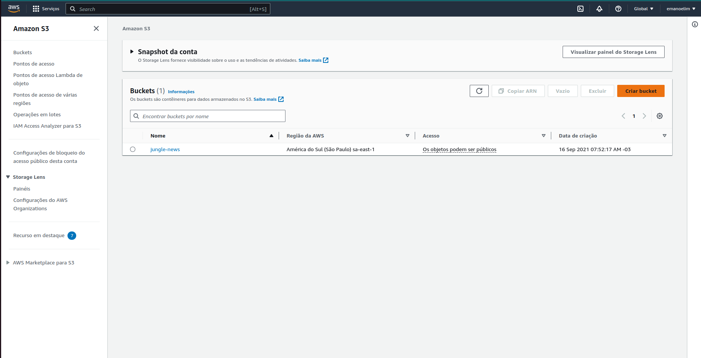

2 - Configure o nome do bucket:

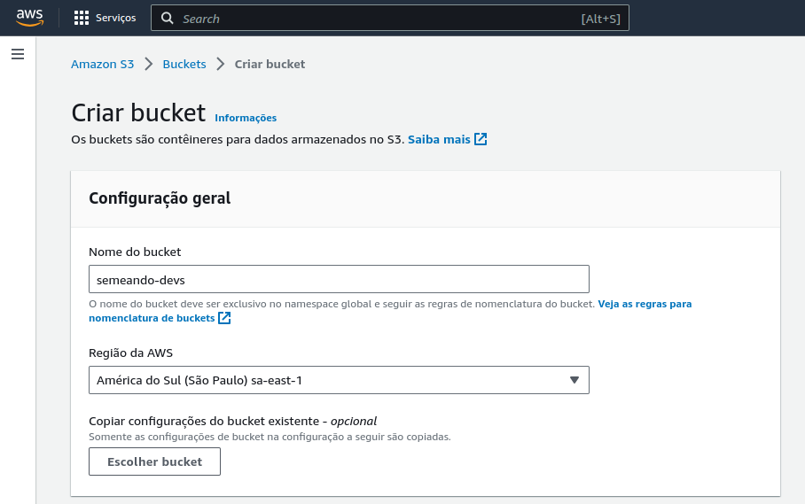

3 - Em "Propriedades do objeto" deixe "ACLs habilitadas" (ao contrário do que está no print):

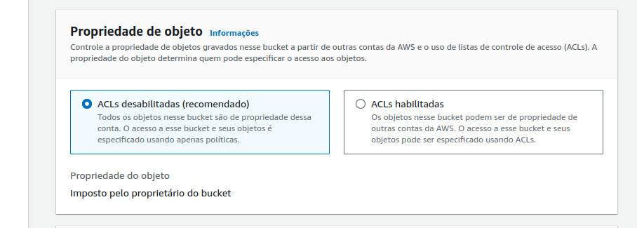

4 - No próximo item, desmarque a opção de bloquear todo o acesso público:

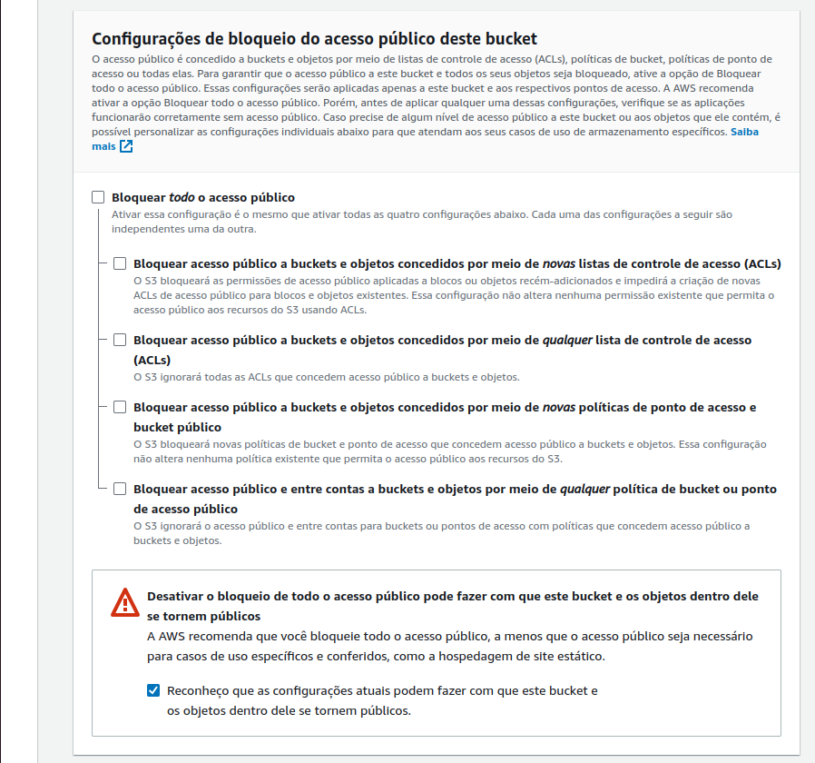

5 - Deixe o versionamento desativado:

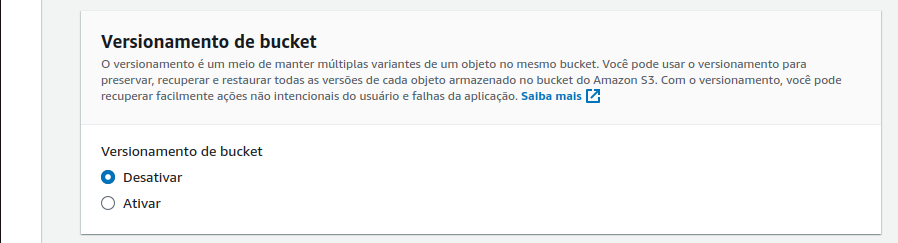

6 - Aqui não é necessário alterar:

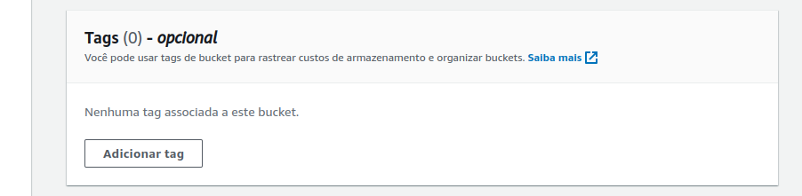

7 - Aqui deixe as configurações padrão:

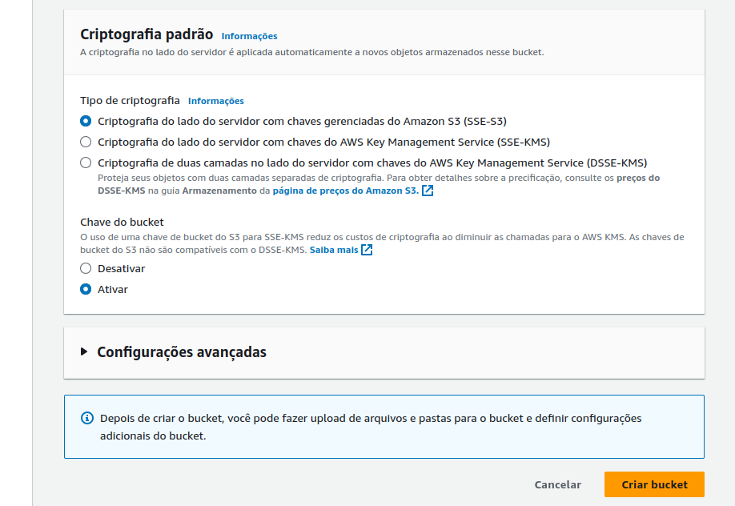

8 - Clique em "Criar bucket".

### Criar grupo

1 - Acessar a url https://us-east-1.console.aws.amazon.com/iamv2/home?region=us-east-1#/groups.

2 - Clique no botão azul para criar novo grupo:

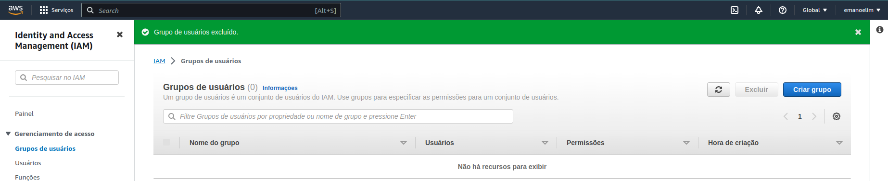

3 - Escolha o nome desejado:

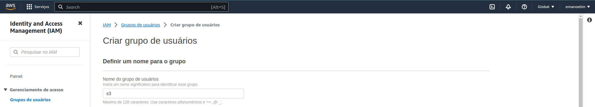

4 - Se for a primeira vez que configura, ainda não haverá usuário, é possível pular essa parte agora:

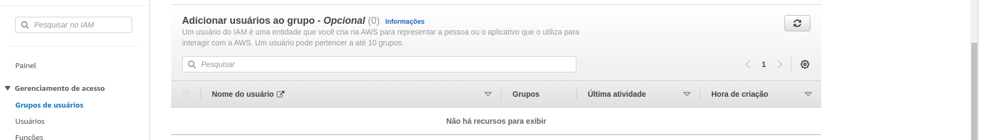

5 - Filtre por s3 e marque a opção indicada:

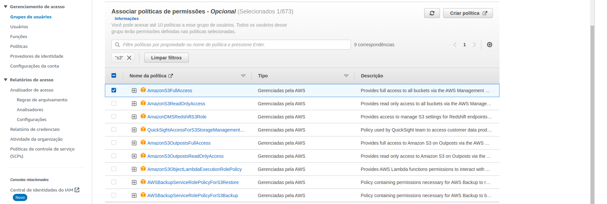

### Criar usuário

1 - Acessar a url https://us-east-1.console.aws.amazon.com/iamv2/home?region=us-east-1#/users.

2 - Crie um novo usuário pelo botão amarelo:

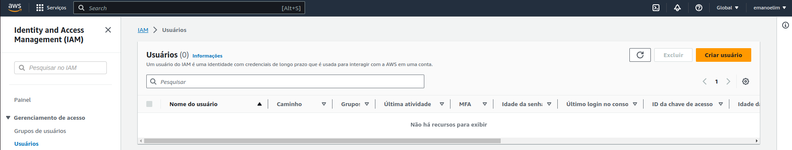

3 - Escolha o nome:

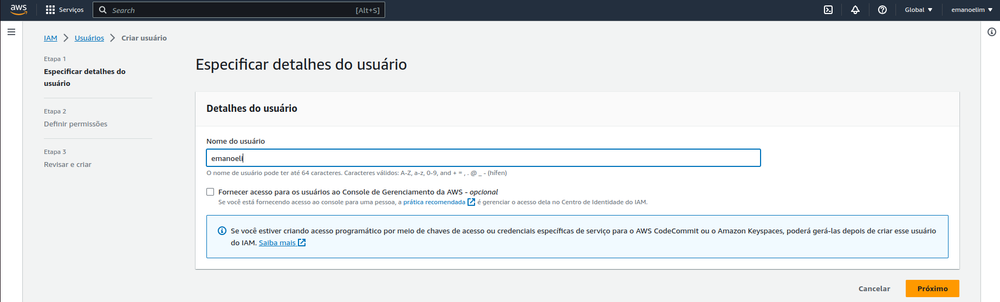

4 - Marque a opção "adicionar usuário ao grupo" e escolha o grupo criado anteriormente:

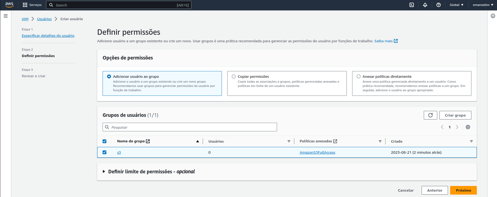

5 - Revise e crie o usuário.

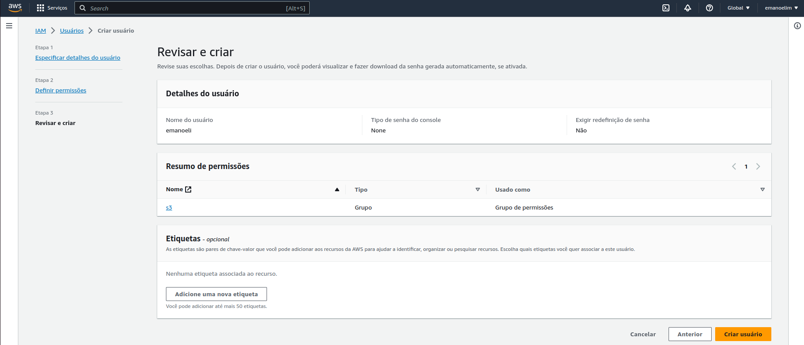

### Criar chave de acesso

O usuário precisa de uma chave de acesso para poder recuperar/alterar objetos no bucket.

1 - No painel dos usuários, clique no link do usuário criado:

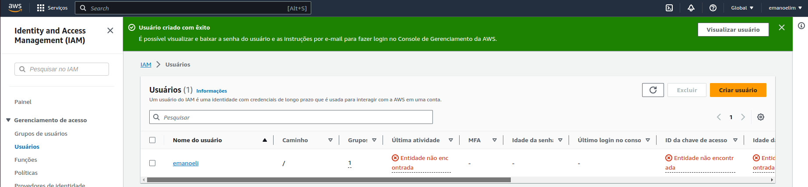

6 - Clique em "criar chave de acesso":

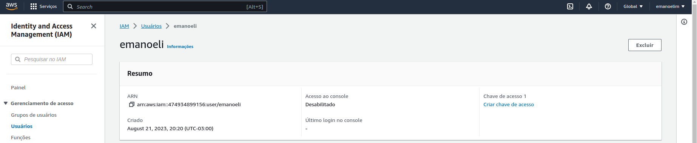

7 - Selecione a opção "código local":

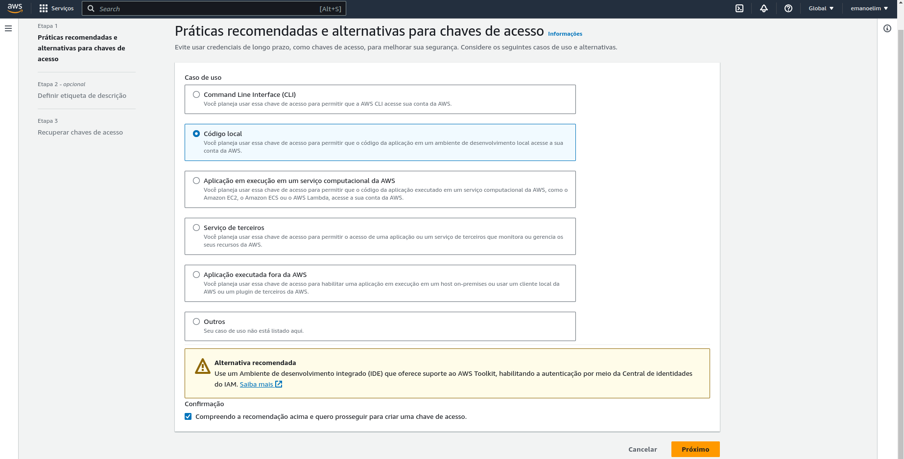

8 - Escolha uma etiqueta para a chave:

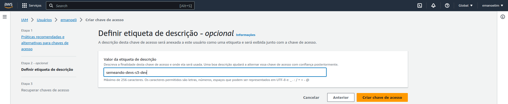

9 - Anote a cheve de acesso e achave de acesso secreta e clique em concluído:

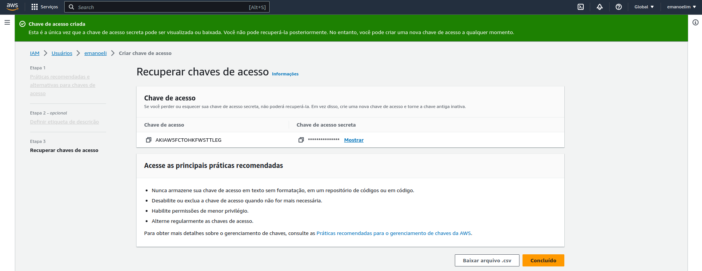

## Configurando o projeto

1 - Instalar as bibliotecas:

- https://pypi.org/project/django-storages/
- https://pypi.org/project/boto3/
- https://pypi.org/project/Pillow/

pip freeze > requirements.txt

2 - Adicionar o storages nos INSTALLED_APPS.

```python
INSTALLED_APPS = [
    ...
    'storages',
    'livros',
    'clientes',
    'pedidos',
    'usuario',
]
```

3 - Subistuitr o conteúdo de:

```python
# Static files (CSS, JavaScript, Images)
# https://docs.djangoproject.com/en/4.1/howto/static-files/

STATIC_URL = 'static/'
STATIC_ROOT = 'staticfiles'
```

Por:

```python
# Static files (CSS, JavaScript, Images)
# https://docs.djangoproject.com/en/4.1/howto/static-files/

USE_S3 = config('USE_S3', default=0, cast=bool)

if USE_S3:
    # aws settings
    AWS_ACCESS_KEY_ID = config('AWS_ACCESS_KEY_ID')
    AWS_SECRET_ACCESS_KEY = config('AWS_SECRET_ACCESS_KEY')
    AWS_STORAGE_BUCKET_NAME = config('AWS_STORAGE_BUCKET_NAME')
    AWS_DEFAULT_ACL = None
    AWS_S3_CUSTOM_DOMAIN = f'{AWS_STORAGE_BUCKET_NAME}.s3.amazonaws.com'
    AWS_S3_OBJECT_PARAMETERS = {'CacheControl': 'max-age=86400'}
    # s3 static settings
    STATIC_LOCATION = 'static'
    STATIC_URL = f'https://{AWS_S3_CUSTOM_DOMAIN}/{STATIC_LOCATION}/'
    STATICFILES_STORAGE = 'utils.storages.StaticStorage'
    # s3 public media settings
    PUBLIC_MEDIA_LOCATION = 'media'
    MEDIA_URL = f'https://{AWS_S3_CUSTOM_DOMAIN}/{PUBLIC_MEDIA_LOCATION}/'
    DEFAULT_FILE_STORAGE = 'utils.storages.PublicMediaStorage'
else:
    STATIC_URL = '/staticfiles/'
    STATIC_ROOT = os.path.join(BASE_DIR, 'staticfiles')
    MEDIA_URL = '/mediafiles/'
    MEDIA_ROOT = os.path.join(BASE_DIR, 'mediafiles')

STATICFILES_DIRS = (os.path.join(BASE_DIR, 'static'),)
```

Quando USE_S3 estiver como False, ao cair no else, o comportamento do sistema será o mesmo que o atual, salvando os arquivos estáticos e arquivos de mídia localmente.

Quando USE_S3 estiver como True, os arquivos serão salvos no s3.

4 - Criar as variáveis no .env para serem usados no settings:

```different
USE_S3 = 1
AWS_ACCESS_KEY_ID = CHAVE_DE_ACESSO
AWS_SECRET_ACCESS_KEY = CHAVE_DE_ACESSO_SECRETA
AWS_STORAGE_BUCKET_NAME = semeando-devs
AWS_LOCATION = sa-east-1
```

A região do bucket aparece aqui (seleção em azul):

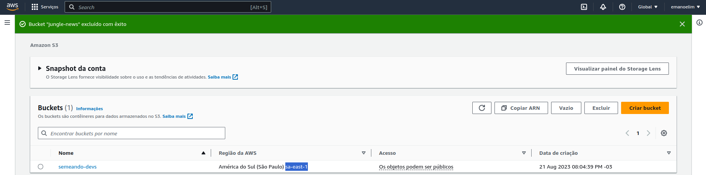

5 - Criar arquivo storages.py na pasta utils:

```python
from django.conf import settings
from storages.backends.s3boto3 import S3Boto3Storage


class StaticStorage(S3Boto3Storage):
    location = 'static'
    default_acl = 'public-read'


class PublicMediaStorage(S3Boto3Storage):
    location = 'media'
    default_acl = 'public-read'
    file_overwrite = False
```

## Arquivos estáticos no bucket

1 - Rodar o comando `python manage.py collectstatic`. Após finalizar, atualize o bucket no console da AWS e veja que foi criada uma pasta chamada "static":

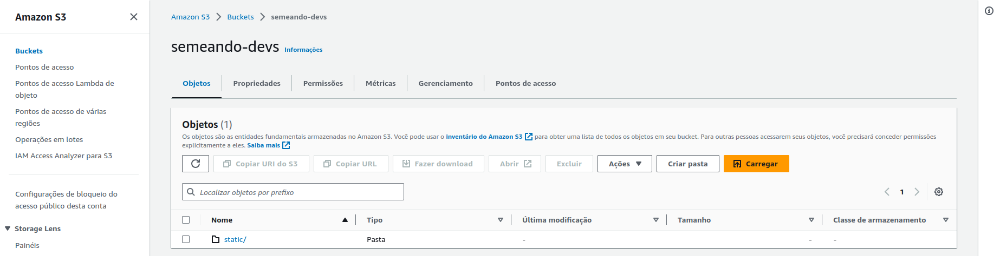

2 - Acesse o admin para conferir se todos os arquivos estáticos carregam corretamente.


## Campo para imagem do livro

1 - Criar um campo de "imagem" no model livro:

```python
    imagem = models.ImageField(null=True, blank=True, upload_to=get_upload_path_livro)
```

Onde get_upload_path_livro é uma função que deve ficar antes da criação da model Livro:

```python
def get_upload_path_livro(instance, filename):
    if not instance.id:
        return f'livros/temp/{filename}'
    return f'livros/{instance.id}/{filename}'
```

2 - Rodar o makemigrations e o migrate.

3 - Abra o admin e cadastre/edite um livro adicionando uma foto no campo de upload.

4 - Atualize o bucket no console da AWS e veja que foi criada a pasta "media":

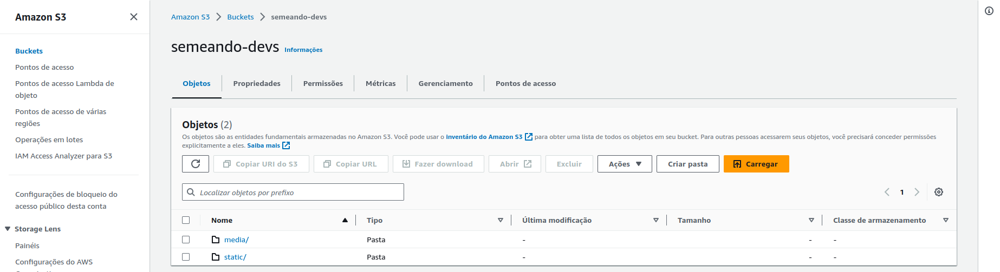

Ao clicar no link "media" você deve ver que foi criada uma pasta "livros". Dentro dela, caso o livro já existisse, deve haver uma pasta com o id do livro. Caso contrário, deve haver uma pasta "temp". A imagem estará dentro de uma dessas pastas.

## Arquivos de mídia privados

Por enquanto estamos salvando apenas imagens das capas dos livros. No futuro poderemos querer salvar documentos do usuário. Neste caso os documentos precisarão ser privados. Por isso, vamos criar uma classe nova em storages.py:

```python
class PrivateMediaStorage(S3Boto3Storage):
    location = 'private'
    default_acl = 'private'
    file_overwrite = False
    custom_domain = False
```

No settings vamos adicionar um trecho de código referente a arquivos de mídia privados:

```python
    ...
    # s3 private media settings
    PRIVATE_MEDIA_LOCATION = 'private'
    PRIVATE_FILE_STORAGE = 'utils.storages.PrivateMediaStorage'
```

Para testar, vamos alterar a model para usar a classe PrivateMediaStorage:

```python
    imagem = models.ImageField(storage=PrivateMediaStorage(), null=True, blank=True, upload_to=get_upload_path_livro)
```

Será necessário rodar o makemigrations e o migrate de novo.

- Crie um novo livro e adicione uma imagem.
- No bucket, encontre a imagem que você adicionou.
- Nas propriedades você verá a "URL de objeto". 
- Copie esta url e cole no navegador. Você deve ter um erro:

```xml
<Error>
<Code>AccessDenied</Code>
<Message>Access Denied</Message>
<RequestId>KTDBBDM10ADV8Q9K</RequestId>
<HostId>AjxgNZYBzO/uo+ofEPMAat4B9K/o/m9KHFJuGpkjXml6WUso8/QNv/WcdyMR1b5Ecwjd0eiIZOP=</HostId>
</Error>
```

Se você fizer o mesmo processo com uma imagem que ficou na pasta "media" em vez de "private", você deve conseguir acessar a imagem normalmente. 

## Atualizando o serializer do livro

Adicione o campo "imagem" no LivroReadSerializer. Ao fazer um GET livros, deve retornar a url da imagem, exemplo:

```json
[
  {
    "id": 1,
    "titulo": "Teste",
    "ano": 2000,
    "autor": {
      "id": 1,
      "nome": "Teste",
      "data_nascimento": "2023-08-01"
    },
    "valor": "30.00",
    "imagem": "https://semeando-devs.s3.amazonaws.com/private/livros/1/1.png?AWSAccessKeyId=AKIAW5FCTOHKFWS&Signature=sy%2F%2Ftr3%2BMR0f%2BbiQnQIYDo%3D&Expires=1692674228"
  }
]
```

Ao copiar a url e acessar pelo navegador, agora deve ser possível abrir a imagem, pois o sistema conhece a AWS_ACCESS_KEY_ID e a AWS_SECRET_ACCESS_KEY e consegue montar uma assinatura válida para acessar a imagem, então o front conseguirá acessá-la normalmente.

Adicione o campo "imagem" também no write serializer do livro. Para testar, você pode usar um programa como o postman ou insomnia. Exemplo do insomnia:

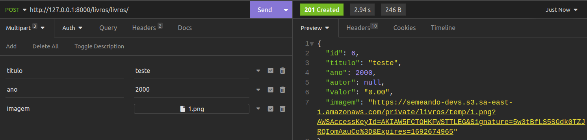

Lembre de setar Authorization = Bearer token nos headers e mude o body para "Multipart form". No botão "add" você poderá adicionar quantos parâmetros forem necessários. Por padrão, eles são do tipo "text", mas clicando na setinha ao lado de cada campo é possível mudar seu tipo. Escolha o tipo "file" para poder anexar a imagem.