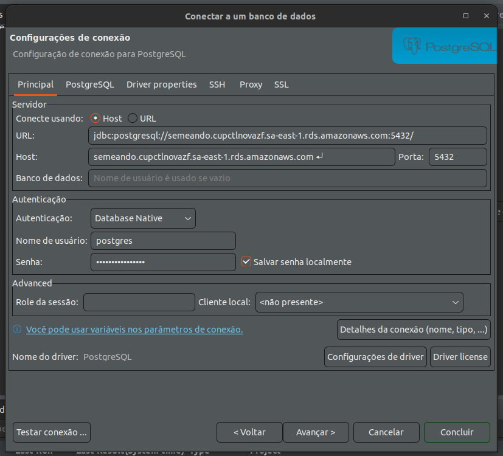

## AWS RDS

Assim como o S3, o RDS (Relational Database Service) é um serviço da AWS. Nele você pode criar bancos de dados relacionais, como Posrgres e MySQL, entre outros.

Ele possui um free tier, com 12 meses gratuitos para novas contas que inclui 750h por mês de uso de instâncias db.t2.micro, db.t3.micro e db.t4g.micro, 20GB de armazenamento de banco de dados de uso geral e 20GB de armazenamento para backups. Apóis ultrapassar os 12 meses ou os limites descritos acima, o pagamento é por utilização.

Algumas vantagens:
- Disponibilidade;
- Backups automatizados do banco e dos logs de transação - no free tier esses dados são mantidos por 7 dias, mas é configurável até 35 dias;
- Escalabilidade - conforme a necessidade de armazenamento cresce, você pode aumentar a capacidade da isntância, isso sem o banco ficar inativa.
- Segurança - permite criptografia dos dados, permite selecionar endereços de IP que podem acessar o banco, entre outros.

### Configurando o banco

1 - Selecione o serviço RDS:


2 - Clique em "Criar banco de dados":


3 - Selecione o modo de "Criação fácil":


4 - Escolha o tipo do banco e o tamanho da instância:


5 - Escolha o identificador da instância, o nome do usuário principal e a senha. Desmarque a opção de gerar senha automaticamente para definir uma senha da sua escolha.


6 - Você será encaminhado para uma listagem onde poderá encontrar a nova instância:


7 - Ao clicar em seu nome, você verá os detalhes:


8 - Na imagem acima é possível ver que a configuração de "Publicamente acessível" está marcada como "Não". Para que possamos acessar da nossa máquina vamos precisar alterar. Clique no botão de "Modificar" e na sessão de "Conectivade" marque a opção "Publicamente acessível" e salve. Pode demorar alguns minutos até que a configuração seja aplicada.


9 - Vá até a sessão de "Regras de grupos de segurança" e clique na regra que contén "Inbound":


10 - Em "Ações", clique em "Editar regras de entrada":


11 - Clique em "Adicionar regra":


12 - Marque as opções conforme a imagem abaixo. Ao selecionar "Meu IP", já irá puxar seu IP automaticamente:


13 - Após salvar, o banco deve estar acessível para usar no Django. Conforme a imagem abaixo, copie o endpoint, ex.: semeando.cupctlnovazf.sa-east-1.rds.amazonaws.com:


14 - Crie uma nova conexão no DBeaver para ver se deu tudo certo. Ao clicar em "Testar conexão" deve ter uma mensagem de sucesso. Após isso clique em "Concluir".



15 - Configure seu .env:

```python
DATABASE_NAME = postgres
DATABASE_USER = postgres
DATABASE_PASSWORD = sua_senha
DATABASE_HOST = semeando.cupctlnovazf.sa-east-1.rds.amazonaws.com
DATABASE_PORT = 5432
```

16 - Rodar o comando `python manage.py runserver`. Se der tudo certo, você terá a saída:

```different
You have 43 unapplied migration(s). Your project may not work properly until you apply the migrations for app(s): account, admin, auth, authtoken, clientes, contenttypes, livros, pedidos, sessions, socialaccount, usuario.
Run 'python manage.py migrate' to apply them.
August 29, 2023 - 09:57:32
Django version 4.2.2, using settings 'livraria.settings'
Starting development server at http://127.0.0.1:8000/
Quit the server with CONTROL-C.
```

17 - Rodar o comando `python manage.py migrate`.

18 - Criar um superuser `python manage.py createsuperuser`.

19 - O sistema já deve estar pronto para uso.