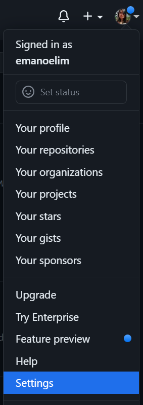
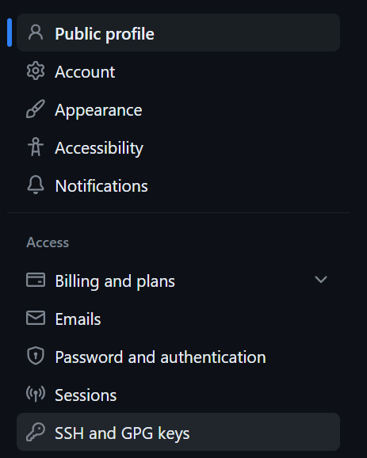
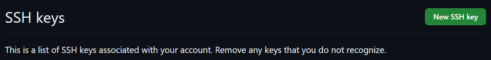
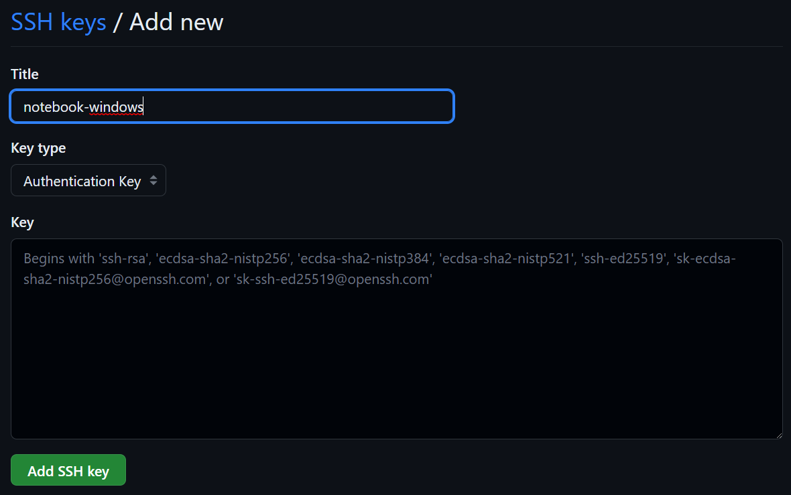

## Configurando a chave SSH

Acessar sua conta do github no menu "Settings":



Abrir o sub menu "SSH and GPG keys":



Irá aparecer um botão para cadastrar uma nova chave SSH:



Essa chave precisa ser gerada no seu computador. Para isso, abrir o Git Bash (windows) ou um terminal normal no linux e rodar o comando: `ssh-keygen -t ed25519 -C "your_email@example.com"`

Deve mostrar um log como no exemplo abaixo:

```different
Generating public/private ed25519 key pair.
Enter file in which to save the key (/c/Users/emano/.ssh/id_ed25519):
```

Pressionar a tecla Enter. Deve aparecer outra mensagem:

```different
Created directory '/c/Users/emano/.ssh'.
Enter passphrase (empty for no passphrase):
```

Não é necessário preencher, basta pressionar Enter novamente. A seguinte mensagem irá aparecer acompanhada da sua chave SSH:

```different
The key fingerprint is:
CHAVE AQUI
```

A chave ficará no caminho indicado no console, no exemplo, em /c/Users/emano/.ssh/id_ed25519. Existirão dois
aquivos, abrir aquele com a extensão .pub. Copiar seu conteúdo após ssh-ed25519 e colar no input, preenchendo também o campo "Title" e então clicando em "Add SSH key:



Em caso de sucesso, uma nova chave com o título que você criou deve ficar listada em SSH Keys.

Feito isso, você não precisará digitar a senha toda vez que for manipular um repositório.

## Clonando um repositório

Na pasta onde deseja guardar o repositório, abrir o Git Bash (windows) ou um terminal normal no linux. Executar o comando: `git clone git@github.com:emanoelim/semeando-devs.git`.

Na primeira vez em que estiver clonando um projeto, deve aparecer a mensagem abaixo. Você deve digitar "yes" e clicar em
Enter.

```different
This key is not known by any other names
Are you sure you want to continue connecting (yes/no/[fingerprint])?
```

Depois disso o repositório será cloando para seu computador.